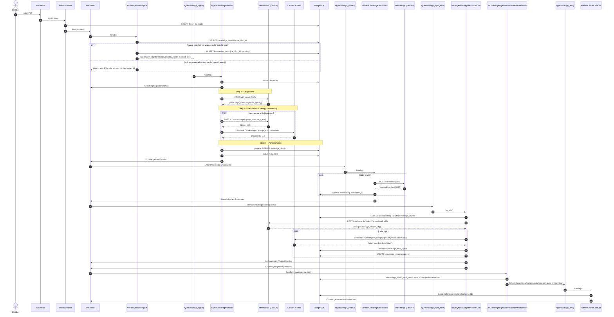

# Knowledge BC — Ingesta, Embeddings, Topics per-doc y Lentes per-owner

> **Estado:** unificado en el BC `Knowledge` desde 2026-04-30 (refactor a partir de los antiguos `Classification` + `Embeddings`). **Bounded Context:** `Knowledge` (carpeta única `app/{Domain,Application,Infrastructure}/Knowledge/`). **Servicios:** Laravel (PHP) + `pdf-chunker` (Python/FastAPI) + `embeddings` (Python/FastAPI).
> 
> ## Histórico
> 
> - **2026-05-05 — Contrato unificado de topics cross-corpus.** El "theme" técnico (clustering emergente) pasa a llamarse **topic** en todo el BC para homogeneizar con LegalCorpus y desambiguar respecto al concepto user-curated (que se renombró a `Project` en la misma fecha). Renombre físico: `knowledge_item_themes → knowledge_item_topics`, `knowledge_owner_themes → corpus_owner_topics` (promovido a tabla cross-BC con columna `sources jsonb`), `knowledge_topic_embeddings → corpus_owner_topic_embeddings`. Columnas en `knowledge_chunks`: `theme_id → topic_id`, `owner_theme_ids → owner_topic_ids`. Renombre de código: `KnowledgeItemTheme → KnowledgeItemTopic`, `KnowledgeOwnerTheme → CorpusOwnerTopic`, `ChunkThemingPort → ChunkTopicAssignmentPort`, `OwnerThemesLens{Read,Write}Port → OwnerTopicsLens{Read,Write}Port`, `ThemeKnowledgeItemJob → IdentifyKnowledgeItemTopicsJob`, `ThemeKnowledgeItemHandler → IdentifyKnowledgeItemTopicsHandler`, `ThemesGroupingStrategy → EmergentTopicsGroupingStrategy`, evento `KnowledgeItemClustered → KnowledgeItemTopicsIdentified`, evento `KnowledgeItemThemingFailed → KnowledgeItemTopicAssignmentFailed`, subscriber `OnKnowledgeItemEmbeddedThemeItem → OnKnowledgeItemEmbeddedIdentifyTopics`, cola `knowledge_theme_item → knowledge_topic_item`, lente registrada `themes → topics`, pipeline_key `theme_knowledge_item → topic_knowledge_item`. `legal_corpus_chunks` recibe columnas espejo `topics` y `owner_topic_ids` para que el retrieval federado tenga la misma SQL shape en ambos BCs. Migración `2026_05_05_000002_unify_topic_schema_cross_corpus.php`.
>     
> - **2026-05-04 — Ownership model unificado.** `knowledge_items` deja de llevar `owner_id` y `source_hash` y pasa a ser 1:1 con `file_blobs` via `file_blob_id UNIQUE` + `ON DELETE CASCADE`. El ownership se deriva per-user via JOIN `files.owner_id = ? AND files.file_blob_id = knowledge_items.file_blob_id`. Corrige el bug latente "user B sube el mismo PDF y su RAG no lo ve" y alinea el BC con `Files` como subdominio compartido (ver `docs/OWNERSHIP_MODEL.md`). Subscriber renombrado `OnFileUploadedIngestPdf → OnFileUploadedIngest` (generic multi-mime por strategy), dedupe por `file_blob_id`. Handlers, jobs y commands propagan `invokedByUserId` + `invokedFileId` en lugar de derivar ownership de la entidad. Migración `2026_05_04_000001_ownership_model_knowledge_items.php`.
>     
> - **2026-04-30 — Refactor a Knowledge BC.** `Classification` + `Embeddings` fusionados en un BC único `Knowledge`. Renombre físico de tablas: `documents → knowledge_items`, `document_chunks → knowledge_chunks`, `document_clusters → knowledge_item_themes`, `canonical_topics → knowledge_owner_themes`, `topic_normalizations → knowledge_topic_embeddings`. Nuevo evento terminal `KnowledgeIngested` que cierra la AccountAction `knowledge.ingest_item`. Añadido el modelo de lentes lazy per-owner (`GroupingStrategy`, `knowledge_owner_lens_states`). Nombres de evento, colas y action_types migrados a `knowledge.*` / `knowledge_*`. Action type renombrado de `classification.process_document` a `knowledge.ingest_item`. Migración SQL atómica en `2026_05_01_000001_rename_classification_tables_to_knowledge.php`. _(Naming_ `_theme_` _de esta fase fue renombrado a_ `_topic_` _el 2026-05-05.)_
>     
> - **2026-04-28 — Pipeline original.** Tres jobs encadenados por domain events.
>     

## Glosario rápido (post-refactor)

- **KnowledgeItem**: el "documento ingerido" (antes `Document`). Tabla `knowledge_items`.
    
- **KnowledgeChunk**: fragmento semántico recuperable. Tabla `knowledge_chunks`.
    
- **KnowledgeItemTopic** (per-doc, eager): grupo HDBSCAN intra-doc. Tabla `knowledge_item_topics`. _(Antes_ `_KnowledgeItemTheme_` _/_ `_knowledge_item_themes_`_.)_
    
- **CorpusOwnerTopic** (per-owner, lazy, cross-BC): vocabulario canónico per-owner que puede provenir de uno o varios oráculos (`hdbscan` desde Knowledge, `eurovoc` desde LegalCorpus, `manual`...). Tabla `corpus_owner_topics`, columna `sources jsonb`. _(Antes_ `_KnowledgeOwnerTheme_` _/_ `_knowledge_owner_themes_`_, Knowledge-only.)_
    
- **OwnerLens**: vista per-owner materializada. Estado en `knowledge_owner_lens_states`.
    
- **GroupingStrategy**: strategy registrada en `config/knowledge.php → lenses`. La única implementación inicial es `EmergentTopicsGroupingStrategy` (lente `topics`). _(Antes_ `_ThemesGroupingStrategy_` _/ lente_ `_themes_`_.)_
    

---

## 1. Propósito

Dado un PDF subido por un Member, el sistema:

1. Extrae el texto página a página.
    
2. Identifica fragmentos semánticos usando un LLM — cada fragmento recibe `topics`, `keywords` y `semantic_type`.
    
3. Vectoriza cada fragmento con el servicio de embeddings.
    
4. Agrupa los fragmentos en topics emergentes per-doc mediante HDBSCAN sobre los vectores.
    
5. El LLM nombra cada topic.
    

El resultado es una base vectorial enriquecida que soporta búsqueda por similitud semántica, filtrado por topic, y RAG sobre los documentos del usuario.

> **Soporte de formatos.** PDF y **Excel/CSV** son ambos ciudadanos de primera clase desde 2026-05-05. v1 tabular es funcional end-to-end: microservicio `tabular` (`/v1/inspect` + `/v1/extract`), pipeline paralelo `IngestTabularPipelineExecutor` (Inspect → Chunking → Persist), chunks con `locator_kind` polimórfico (`page` | `row_block` | `sheet_summary`), citas en chat polimorfas. **Pendiente:** v2a regiones estructurales, v2b LLM classifier, v3 DuckDB query tool. Documento dedicado: `[TABULAR_INGESTION.md](./TABULAR_INGESTION.md)`. El resto del BC (saga eager, lentes, RAG, federator, eventos) **no cambia** con la extensión tabular — la diferencia vive en cómo se extrae contenido del fichero, no en cómo se consulta.

---

## 2. Visión general — Saga eager + lentes lazy

La ingesta eager se desacopla en tres jobs por domain events. Tras la saga eager se cierra con el evento terminal `KnowledgeIngested`, que dispara la invalidación de las lentes per-owner:

```
FileUploaded
    ↓
IngestKnowledgeItemJob       (cola: knowledge_ingest)
    → Step 1: InspectPdf
    → Step 2: SemanticChunking
    → Step 3: PersistChunks
    ↓ emite KnowledgeItemChunked

EmbedKnowledgeChunksJob          (cola: knowledge_embed)
    → vectoriza cada chunk
    ↓ emite KnowledgeItemEmbedded

IdentifyKnowledgeItemTopicsJob   (cola: knowledge_topic_item)
    → HDBSCAN sobre vectores del item
    → LLM nombra cada topic per-doc
    ↓ emite KnowledgeItemTopicsIdentified
    ↓ emite KnowledgeIngested  (evento terminal de la saga eager)

OnKnowledgeIngestedInvalidateOwnerLenses
    → marca todas las lentes registradas del owner como `stale`
    → si auto_refresh=true, encola RefreshOwnerLensJob por cada lente

RefreshOwnerLensJob              (cola: knowledge_lens)
    → llama a la GroupingStrategy::materialize(ownerId)
    ↓ emite KnowledgeOwnerLensRefreshed
```

Cada job tiene una única responsabilidad y puede fallar/reintentar de forma independiente. Añadir una **lente nueva** (por ejemplo, agrupar por departamento) es un cambio de config, no del pipeline: basta con registrar una nueva `GroupingStrategy` en `config/knowledge.php → lenses`. El bus se encarga de invalidarla automáticamente con cada ingesta.

---

## 3. IngestKnowledgeItemJob — Pipeline de 3 steps

### Step 1: InspectPdfStepHandler

Valida el PDF y extrae metadata técnica.

**Llama a:** `POST /v1/inspect` (multipart, envía el PDF)

**Produce en state:**

- `valid`, `encrypted`, `pageCount`, `ingestionQuality`, `hasTextLayer`
    
- Si falla → `rejectReason` → `PersistChunksStepHandler` emite `KnowledgeItemRejected`
    

### Step 2: SemanticChunkingStepHandler

Extrae texto por ventanas de páginas y pide al LLM que identifique fragmentos semánticos dentro de cada ventana.

**Algoritmo de ventanas:**

- Ventana de `N` páginas (por defecto 4) con `M` páginas de contexto (por defecto 1) antes y después.
    
- El contexto se pasa al LLM solo como referencia — los fragmentos generados pertenecen exclusivamente a las páginas "core" de la ventana.
    
- Cada ventana hace una llamada al servicio Python para obtener el texto y una llamada al LLM (via Laravel AI SDK).
    

**Para cada ventana:**

1. `POST /v1/extract-pages` → texto por página en el rango.
    
2. Laravel AI SDK → `SemanticChunkerAgent` con un prompt que incluye contexto previo/siguiente.
    
3. El LLM devuelve JSON: `{fragments: [{page_start, page_end, start_anchor, end_anchor, topics, keywords, semantic_type}]}`.
    
4. PHP localiza los anchors textuales (citas exactas del inicio/fin de cada fragmento) en el texto de las páginas y extrae el substring preciso. Esto permite cortar a nivel de párrafo, no de página completa.
    

**Si los anchors no se encuentran:** fallback a concatenar las páginas completas del rango.

**Si el LLM falla en una ventana:** fallback — el texto de la ventana se divide en bloques de ~800 chars cortando por párrafos.

**Produce en state:** `pendingChunks[]` — lista de fragmentos con su texto y metadata.

### Step 3: PersistChunksStepHandler

Persiste los chunks, actualiza el estado del knowledge item y emite el evento que dispara la siguiente etapa.

- Ejecuta `purgeForKnowledgeItem()` antes de insertar (idempotencia en reprocesado).
    
- `knowledge_item.status` → `chunked`.
    
- Emite `KnowledgeItemChunked`.
    

---

## 3.bis. Concurrencia del chunker semántico (2026-05-07)

El step 2 (`SemanticChunkingStepHandler`) tiene **dos niveles ortogonales de paralelismo**, ambos disponibles hoy:

### Nivel 1 — Intra-documento: ventanas en paralelo dentro del mismo job

Un solo `IngestKnowledgeItemJob` parte el documento en N ventanas y dispara hasta `parallel_concurrency` llamadas LLM **simultáneas** contra el provider configurado. La primera respuesta libera slot para la siguiente ventana — patrón clásico de pool con backpressure.

Implementado en `SemanticChunkingStepHandler::processWindowsParallel()` con `Illuminate\Support\Facades\Http::pool` (Guzzle async). Bypaseamos el AI SDK (Prism / `Laravel\Ai\Agent`) porque **el SDK no expone API de concurrencia**: `Agent::prompt()` es síncrono. Reescribir esto a futuras versiones del SDK es trivial; la lógica de construcción de body, schema strict y parsing está aislada en el handler.

Activado cuando `parallel_concurrency >= 2`. Con `=1` el handler cae al path tradicional vía `TracedLlmCall::run(...)` (con tracing detallado per-window y `llm_call_records` por llamada).

**Trade-off del modo paralelo:** no se persiste `llm_call_records` per-window (solo agregados en `pipeline_steps.snapshot`). El span padre del step lleva el wallclock total y el conteo de ventanas. Si en producción hace falta auditoría detallada per-llamada, bajar `parallel_concurrency=1`.

**Body shape switch.** El handler detecta el shape esperado por el provider:

- Driver `ollama` → `/api/chat` con `format` en root y `message.content` en respuesta.
    
- Driver `openrouter` (vLLM y compatibles) → `/v1/chat/completions` con `response_format.json_schema.strict=true` y `choices[0].message.content` en respuesta.
    

`extra_body` declarado en el provider de `config/ai.php` se mergea automáticamente al body. Es como vLLM Qwen3 recibe `chat_template_kwargs.enable_thinking=false` (sin esto Qwen3 escupe `<think>...</think>` dentro de `content`).

### Nivel 2 — Inter-documento: N workers en la cola `knowledge_ingest`

Cada worker procesa un knowledge item distinto. Si arrancas 4 procesos `queue:work --queue=knowledge_ingest`, son 4 documentos en paralelo, **cada uno con su propia conc=N** → potencialmente `4 × N` requests LLM simultáneos contra el backend.

El bus de eventos garantiza que los pasos posteriores (Embed, IdentifyTopics) no se solapan con el chunking del mismo doc — ver §15 para la justificación de una cola por fase.

### Overrides de Prism para hybrid-think models

Los modelos **hybrid-think** (Nemotron-3 nano/super, Qwen3) razonan internamente por defecto y devuelven el resultado en un canal separado del `content`. Si no se desactiva el thinking explícitamente, el chunker recibe `content` vacío y `thinking` con el JSON dentro — el parser cae al fallback. Hay dos vectores de fix porque cada provider expone el switch en un sitio distinto:

|   |   |   |
|---|---|---|
|Provider|Cómo se desactiva|Dónde está el código|
|Ollama nativo (`spark`)|`think: false` en root del body de `/api/chat`|`app/Infrastructure/Ai/Prism/OllamaWithThink.php` + `StructuredHandlerWithThink.php`|
|vLLM Qwen3 (`vllm_q3`)|`extra_body.chat_template_kwargs.enable_thinking=false`|`config/ai.php → providers.vllm_q3.extra_body` (mergeado en handler)|

**Override de Prism (path Structured de Ollama).** El `Structured` handler oficial NO envía `think:false` al body (sí lo hace en `Text`/`Stream`). Sin él, los Nemotron rellenan `message.thinking` con el JSON y dejan `content` vacío. La fix sin tocar vendor:

1. `OllamaWithThink extends Ollama` — sobrescribe únicamente `structured()`.
    
2. `StructuredHandlerWithThink` — copia del handler oficial con `think:false` añadido al body.
    
3. Se registra en `AppServiceProvider::boot()` con `PrismManager::extend('ollama', ...)`.
    

El resto de paths (text, stream, embeddings) heredan del provider original. Solo afecta a llamadas con structured output (las que enrutan vía `Agent::prompt()` cuando el agente declara `schema()`).

### Performance de referencia (2026-05-07)

55 páginas (EFRAG IG 1) — config canónica = `vllm_q3` + `nvidia/Qwen3-14B-FP8` + window 4+1 + conc=8 + prompt v2:

|   |   |   |   |
|---|---|---|---|
|Setup|Wallclock|Chunks|Aceleración|
|Serial baseline (path tradicional)|~~712 s (~~12 min)|~95|1.0×|
|Ollama qwen2.5:14b conc=6|372 s (~6.2 min)|96|1.91×|
|**vLLM Qwen3-14B-FP8 conc=8**|**146 s (~2.4 min)**|**117**|**4.88×**|

vLLM hace **dynamic batching** nativo: las 8 peticiones simultáneas se meten en el mismo forward pass de la GPU. Ollama serializa internamente, por eso conc>4 da diminishing returns ahí.

### Cuándo subir o bajar `parallel_concurrency`

|   |   |   |   |
|---|---|---|---|
|Escenario|Workers `knowledge_ingest`|`PARALLEL_CONCURRENCY`|Por qué|
|Subida interactiva 1 doc/usuario|1-2|8|Latencia mínima end-to-end|
|Batch nocturno / corpus grande|3-4|4|Mejor throughput agregado, evita saturar vLLM|
|Saturar GPU (ingesta masiva)|4-6|4|`conc × workers ≈ 16-32` es donde vLLM aún escala lineal|
|Debug / auditoría per-llamada|1|1|`llm_call_records` per-window persistidos|

Pasados ~32 in-flight a vLLM, latencia per-window sube y throughput se aplana. La GPU tiene KV cache finito (depende de `--max-num-seqs` al arrancar `vllm serve`).

### Ficheros clave

- `app/Application/Knowledge/Pipeline/Steps/SemanticChunkingStepHandler.php` — `processWindowsParallel`, body shape switch, merge de `extra_body`, normalización del page map (whitespace + strip de headers/footers repetidos).
    
- `app/Ai/Agents/SemanticChunkerAgent.php` — schema strict (anchors max 200 chars, fragments max 12), `providerOptions()` con `thinking:false` para Ollama.
    
- `app/Ai/Agents/SemanticChunker/Prompts/v2.php` — variante de prompt activa en producción (anti-mezcla idiomas + ignora paginación + cada fragment único).
    
- `app/Infrastructure/Ai/Prism/{OllamaWithThink,StructuredHandlerWithThink}.php` — override del path Structured de Ollama.
    
- `app/Providers/AppServiceProvider.php` — registro vía `PrismManager::extend('ollama', ...)`.
    
- `config/ai.php` — providers `spark` (driver=ollama) y `vllm_q3` (driver=openrouter, con `extra_body`).
    

---

## 4. EmbedKnowledgeChunksJob

Vectoriza cada chunk del item llamando al servicio de embeddings uno a uno.

- Lee `knowledge_chunks` donde `embedded_at IS NULL`.
    
- `POST /api/embed` (Ollama, default) o `POST /v1/embed` (driver `python` legacy) por cada chunk → vector de 1024 dimensiones (`bge-m3:latest`).
    
- Actualiza `embedding`, `embedded_at`, `embedding_model` en `knowledge_chunks`.
    
- Al finalizar, si `embedded_count > 0` → emite `KnowledgeItemEmbedded`.
    
- Si la fase falla sin haber vectorizado nada → emite `KnowledgeItemEmbeddingFailed`.
    

---

## 5. IdentifyKnowledgeItemTopicsJob

Agrupa los chunks per-doc por similitud semántica y nombra cada topic. Es la **última fase eager** — al terminar emite el evento terminal `KnowledgeIngested`.

**Proceso:**

1. Lee todos los chunks con `embedding IS NOT NULL` para el knowledge item.
    
2. `POST /v1/cluster` → HDBSCAN sobre los vectores (Python, scikit-learn).
    
3. Por cada cluster válido (label ≥ 0):
    
    - Toma hasta 4 chunks representativos.
        
    - Llama al LLM con sus topics/keywords para obtener un nombre descriptivo (`{"label": "..."}`).
        
    - Crea registro en `knowledge_item_topics`.
        
    - Actualiza `chunk.topic_id`.
        
4. Emite `KnowledgeItemTopicsIdentified`.
    
5. Acto seguido emite `KnowledgeIngested` (terminal) con `chunkCount` y `topicCount` (número de topics per-doc identificados).
    

Los chunks con label `-1` (ruido HDBSCAN) quedan con `topic_id = NULL`. Si el job revienta, emite `KnowledgeItemTopicAssignmentFailed` (terminal de fallo).

`KnowledgeIngested` lo recoge `OnKnowledgeIngestedInvalidateOwnerLenses`, que marca todas las lentes registradas del owner como `stale` y, si `auto_refresh = true`, encola `RefreshOwnerLensJob` por cada lente afectada. Hoy la única lente registrada (`topics`) es lazy on-read (`auto_refresh = false`): la materialización ocurre solo cuando alguien la lee.

---

## 6. Flujo completo (sequence diagram)



---

## 7. Estructura de código

### PHP

```
Application/Knowledge/
├── Commands/
│   ├── IngestKnowledgeItem.php
│   ├── EmbedKnowledgeChunks.php
│   ├── IdentifyKnowledgeItemTopics.php
│   ├── RefreshOwnerLens.php
│   ├── EmbedText.php
│   └── SearchKnowledgeChunks.php
├── Handlers/
│   ├── IngestKnowledgeItemHandler.php
│   ├── EmbedKnowledgeChunksHandler.php
│   ├── IdentifyKnowledgeItemTopicsHandler.php   ← emite KnowledgeIngested al final
│   ├── EmbedTextHandler.php
│   ├── ListKnowledgeItemsHandler.php
│   ├── ShowKnowledgeItemHandler.php
│   ├── GetKnowledgeItemDiskHandler.php
│   └── SearchKnowledgeChunksHandler.php
├── Pipeline/
│   ├── IngestKnowledgeItemPipelineConfig.php
│   ├── IngestKnowledgeItemPipelineState.php
│   ├── IngestKnowledgeItemPipelineExecutor.php   ← orquesta 3 steps
│   ├── PipelineRunRepositoryPort.php
│   ├── StepHandler.php
│   ├── StepStatus.php
│   └── Steps/
│       ├── InspectPdfStepHandler.php
│       ├── SemanticChunkingStepHandler.php
│       └── PersistChunksStepHandler.php
├── Lenses/
│   ├── ListOwnerLensesHandler.php
│   ├── GetOwnerLensHandler.php
│   ├── RefreshOwnerLensHandler.php
│   ├── InvalidateOwnerLensesHandler.php
│   └── Strategies/
│       └── EmergentTopicsGroupingStrategy.php   ← era NormalizeTopicsHandler / ThemesGroupingStrategy
├── Queries/
│   └── ListKnowledgeItemsQuery.php
└── Subscribers/
    ├── OnFileUploadedIngest.php                  ← antes OnFileUploadedIngestPdf; generic multi-mime via strategy
    ├── OnKnowledgeItemChunkedEmbedChunks.php
    ├── OnKnowledgeItemEmbeddedIdentifyTopics.php
    ├── OnKnowledgeIngestedInvalidateOwnerLenses.php
    ├── OnKnowledgeIngestProgressTrackAccountAction.php
    ├── OnFileDeletedClosePendingKnowledgeActions.php
    └── OnFileDeletedInvalidateOwnerLenses.php

Domain/Knowledge/
├── Entities/
│   └── KnowledgeItem.php
├── ValueObjects/
│   ├── IngestionStatus.php                    ← pending|ingesting|chunked|rejected
│   ├── IngestionProfile.php                   ← deep|fast (perfil de servicio)
│   ├── IngestionQuality.php
│   └── EmbeddingVector.php
├── Lenses/
│   ├── GroupingStrategy.php                   ← interface
│   ├── GroupingStrategyRegistry.php           ← port
│   ├── LensName.php                           ← VO (slug)
│   ├── LensState.php                          ← enum
│   └── LensView.php                           ← read-model
├── Ports/
│   ├── PdfInspectionPort.php                  (POST /v1/inspect)
│   ├── PageTextExtractionPort.php             (POST /v1/extract-pages)
│   ├── ClusteringServicePort.php              (POST /v1/cluster)
│   ├── ChunkPersistencePort.php
│   ├── ChunkEmbeddingQueuePort.php
│   ├── ChunkTopicAssignmentPort.php
│   ├── RetrievableChunkReadPort.php
│   ├── KnowledgeItemRepositoryPort.php
│   ├── KnowledgeItemReadPort.php
│   ├── OwnerTopicsLensReadPort.php
│   ├── OwnerTopicsLensWritePort.php
│   ├── OwnerLensStateRepositoryPort.php
│   ├── DiskProjectionPort.php
│   └── TextEmbeddingPort.php
├── Events/
│   ├── KnowledgeIngestionStarted.php
│   ├── KnowledgeItemChunked.php
│   ├── KnowledgeItemEmbedded.php
│   ├── KnowledgeItemEmbeddingFailed.php
│   ├── KnowledgeItemTopicsIdentified.php
│   ├── KnowledgeItemTopicAssignmentFailed.php
│   ├── KnowledgeItemRejected.php
│   ├── KnowledgeIngested.php                  ← terminal eager
│   ├── KnowledgeOwnerLensInvalidated.php
│   └── KnowledgeOwnerLensRefreshed.php
└── Exceptions/
    ├── KnowledgeServiceException.php
    ├── KnowledgeItemCorruptException.php
    ├── KnowledgeItemNotFoundException.php
    ├── KnowledgeItemNotPdfException.php
    ├── KnowledgeItemProtectedException.php
    └── EmbeddingServiceException.php

Infrastructure/Knowledge/
├── Adapters/
│   ├── AbstractKnowledgeServiceClient.php     ← multipart + RFC7807
│   ├── HttpPdfInspectionClient.php
│   ├── HttpPageTextExtractorClient.php
│   ├── HttpClusteringClient.php               ← JSON (no multipart)
│   ├── HttpDiskProjectionClient.php
│   └── HttpTextEmbeddingClient.php
├── Lenses/
│   ├── ConfigGroupingStrategyRegistry.php
│   └── EloquentOwnerLensStateRepository.php
├── Jobs/
│   ├── IngestKnowledgeItemJob.php
│   ├── EmbedKnowledgeChunksJob.php
│   ├── IdentifyKnowledgeItemTopicsJob.php
│   └── RefreshOwnerLensJob.php
└── Persistence/
    ├── Casts/
    │   └── PgVectorCast.php
    ├── Models/
    │   ├── KnowledgeItem.php                  ← table = knowledge_items
    │   ├── KnowledgeChunk.php
    │   ├── KnowledgeItemTopic.php             ← table = knowledge_item_topics
    │   ├── CorpusOwnerTopic.php               ← table = corpus_owner_topics (cross-BC)
    │   ├── CorpusOwnerTopicEmbedding.php      ← table = corpus_owner_topic_embeddings
    │   ├── KnowledgeOwnerLensState.php
    │   ├── PipelineRun.php
    │   └── PipelineStep.php
    └── Repositories/
        ├── EloquentKnowledgeItemRepository.php
        ├── EloquentKnowledgeItemReadRepository.php
        ├── EloquentChunkPersistence.php
        ├── EloquentChunkEmbeddingQueue.php
        ├── EloquentChunkTopicAssignmentRepository.php
        ├── EloquentRetrievableChunkReadRepository.php
        ├── EloquentOwnerTopicsLensReadRepository.php
        ├── EloquentOwnerTopicsLensWriteRepository.php
        └── EloquentPipelineRunRepository.php

Ai/Agents/
└── SemanticChunkerAgent.php                   ← one-shot, sin RemembersConversations
```

### Python (`services/pdf-chunker/`)

```
app/
├── api/routes/
│   ├── inspect.py          POST /v1/inspect
│   ├── extract_pages.py    POST /v1/extract-pages
│   └── cluster.py          POST /v1/cluster
├── application/
│   ├── inspect_document.py
│   ├── extract_pages.py
│   └── cluster_chunks.py
├── ports/
│   ├── pdf_inspector.py
│   ├── page_text_provider.py
│   └── clustering_provider.py
└── infrastructure/
    ├── pdf/
    │   ├── pymupdf_adapter.py              ← inspector
    │   └── pymupdf_page_text.py            ← extractor de texto por página
    └── clustering/
        └── sklearn_hdbscan.py              ← HDBSCAN via scikit-learn ≥ 1.3
```

---

## 8. Base de datos

### `knowledge_items` — un item por blob ingerido (1:1 con `file_blobs`)

|   |   |   |
|---|---|---|
|Columna|Tipo|Descripción|
|`id`|bigserial|PK|
|`file_blob_id`|FK → file_blobs (`UNIQUE`, `ON DELETE CASCADE`)|Identidad canónica del item. **No** lleva `owner_id` — el ownership se deriva via `files.owner_id = ? AND files.file_blob_id = knowledge_items.file_blob_id` (ver `docs/OWNERSHIP_MODEL.md`). **No** lleva `source_hash` — está en `file_blobs.checksum`.|
|`mime_type`|varchar(64)|siempre `application/pdf` hoy (futuro: más strategies por mime)|
|`byte_size`|bigint||
|`page_count`|int|tras inspect|
|`status`|varchar(32)|enum `IngestionStatus` (pending / ingesting / chunked / rejected)|
|`profile`|varchar(16) default 'deep'|enum `IngestionProfile` (`deep` / `fast`) — perfil de servicio para este item. Hoy solo se persiste; el executor aún no ramifica por perfil. Ver §13 "Decisiones de diseño"|
|`current_classification_result_id`|int (legacy, deprecated)|residuo del sistema anterior; se conserva por compat|

> **Migración 2026-05-04**: `ownership_model_knowledge_items` elimina `owner_id`, `source_hash` y la FK directa a `files`, añade `file_blob_id UNIQUE` con cascade desde `file_blobs`. Backfill derivaba `file_blob_id` haciendo lookup por el antiguo `file_id`. Consecuencia de negocio: se arregla el bug latente "user B sube el mismo PDF que A y su RAG no lo ve" (el KnowledgeItem se comparte, el ownership lo aporta Files). Ver decisión completa en `docs/OWNERSHIP_MODEL.md` §3.

### `knowledge_chunks` — fragmentos recuperables

|   |   |   |
|---|---|---|
|Columna|Tipo|Descripción|
|`id`|bigserial|PK|
|`knowledge_item_id`|FK → knowledge_items||
|`ordinal`|int|Orden dentro del item|
|`text`|text|Texto del fragmento|
|`page_start`|smallint|Primera página|
|`page_end`|smallint|Última página|
|`topics`|jsonb|Lista de temas (LLM)|
|`keywords`|jsonb|Lista de palabras clave (LLM)|
|`semantic_type`|varchar(32)|narrative / definition / procedure / data / regulation / example / summary / mixed|
|`topic_id`|FK → knowledge_item_topics|Null si ruido HDBSCAN. _(Antes_ `_theme_id_`_.)_|
|`owner_topic_ids`|jsonb|IDs de `corpus_owner_topics` que contienen este chunk. Naming espejo en `legal_corpus_chunks.owner_topic_ids` para retrieval federado. _(Antes_ `_owner_theme_ids_`_.)_|
|`embedding`|vector(384)|pgvector — índice IVFFlat coseno|
|`embedded_at`|timestamptz|Cuándo se vectorizó|
|`embedding_model`|varchar(64)|Modelo de embeddings usado|
|`metadata`|jsonb|Extensible|

### `knowledge_item_topics` — topics intra-documento (HDBSCAN per-doc)

|   |   |   |
|---|---|---|
|Columna|Tipo|Descripción|
|`id`|bigserial|PK|
|`knowledge_item_id`|FK → knowledge_items||
|`label`|varchar(255)|Nombre generado por LLM|
|`representative_topics`|jsonb|Topics agregados del cluster|
|`chunk_count`|int|Fragmentos en el cluster|
|`centroid`|vector(384)|Centroide del cluster (opcional)|

_(Antes_ `_knowledge_item_themes_`_. Renombre 2026-05-05.)_

### `corpus_owner_topics` — vocabulario canónico per-owner cross-BC (lente lazy `topics`)

Promovida de Knowledge-only a tabla compartida entre BCs (`Knowledge` y `LegalCorpus`). Cada topic puede provenir de uno o varios oráculos.

|   |   |   |
|---|---|---|
|Columna|Tipo|Descripción|
|`id`|bigserial|PK|
|`owner_id`|FK → users||
|`label`|varchar(255)|Nombre canónico del topic|
|`keywords`|jsonb|Keywords agregadas|
|`representative_topics`|jsonb||
|`document_count`|int|Documentos del owner que contribuyen|
|`chunk_count`|int||
|`centroid`|vector(384)|Centroide del cluster cross-doc|
|`sources`|jsonb default `'[]'`|Lista de oráculos que contribuyeron al topic: `['hdbscan']` (Knowledge), `['eurovoc']` (LegalCorpus), `['hdbscan','eurovoc']` (cruce), `['manual']` (futuro).|

_(Antes_ `_knowledge_owner_themes_`_, sin columna_ `_sources_`_. Renombre + promoción cross-BC 2026-05-05.)_

### `corpus_owner_topic_embeddings` — caché de embeddings de topics (per-owner, cross-BC)

Caché reutilizable de los embeddings de topics ya vistos. **No se purga al borrar un File** (los embeddings siguen siendo válidos). Mantiene FK a `corpus_owner_topics` (`corpus_owner_topic_id`).

_(Antes_ `_knowledge_topic_embeddings_` _con FK_ `_knowledge_owner_theme_id_`_. Renombre 2026-05-05.)_

### `knowledge_owner_lens_states` — estado de cada lente per-owner

|   |   |   |
|---|---|---|
|Columna|Tipo|Descripción|
|`id`|bigserial|PK|
|`owner_id`|FK → users||
|`lens_name`|varchar(64)|slug (`topics`, futuras `by_department`, ...)|
|`state`|varchar(32)|`fresh` \| `stale` \| `refreshing` \| `failed`|
|`materialized_at`|timestamptz|Último refresh exitoso|
|`last_refresh_started_at`|timestamptz|Si está en curso|
|`last_error`|text|Si `state = failed`|

`UNIQUE(owner_id, lens_name)`.

---

## 9. Endpoints del servicio Python

|   |   |   |   |
|---|---|---|---|
|Endpoint|Método|Entrada|Salida|
|`/v1/inspect`|POST|multipart: `file`, `source_hash`|`{valid, page_count, ingestion_quality, encrypted, has_text_layer, mime, reason?}`|
|`/v1/extract-pages`|POST|multipart: `file`, `source_hash`, `page_start`, `page_end`|`{pages: [{page, text, char_count}], total_pages, took_ms}`|
|`/v1/cluster`|POST|JSON: `{chunks: [{id, embedding}], min_cluster_size, min_samples}`|`{assignments: [{id, cluster_id}], cluster_count, noise_count, took_ms}`|

Los errores de `/v1/inspect` siguen RFC 7807 (`type` con código de dominio: `document.corrupt`, `document.protected`, `document.unsupported_mime`). El adapter PHP los mapea a excepciones tipadas.

---

## 10. Configuración

### `.env`

```env
# Servicio Python (pdf-chunker)
KNOWLEDGE_INGESTION_SERVICE_URL=http://127.0.0.1:8002   # dev
KNOWLEDGE_INGESTION_SERVICE_TIMEOUT=120

# Colas (una por fase de la saga) — ver §15
KNOWLEDGE_INGEST_QUEUE=knowledge_ingest         # IngestKnowledgeItemJob
KNOWLEDGE_EMBED_QUEUE=knowledge_embed           # EmbedKnowledgeChunksJob
KNOWLEDGE_TOPIC_ITEM_QUEUE=knowledge_topic_item # IdentifyKnowledgeItemTopicsJob
KNOWLEDGE_LENS_QUEUE=knowledge_lens             # RefreshOwnerLensJob (cualquier lente)

# Chunking semántico — config canónica de producción (ver §3.bis)
SEMANTIC_CHUNKING_PROVIDER=vllm_q3              # backend del LLM (driver openrouter en config/ai.php)
SEMANTIC_CHUNKING_MODEL=nvidia/Qwen3-14B-FP8    # modelo cargado en vLLM
SEMANTIC_CHUNKING_WINDOW_SIZE=4                 # páginas core por ventana
SEMANTIC_CHUNKING_CONTEXT_SIZE=1                # páginas de contexto en cada extremo
SEMANTIC_CHUNKING_PARALLEL_CONCURRENCY=8        # ventanas en vuelo simultáneas (Http::pool)
SEMANTIC_CHUNKING_PROMPT_VARIANT=v2             # v1 legacy / v2 producción / v2-strict experimental

# Embeddings (driver=ollama por defecto; bge-m3 1024 dims)
KNOWLEDGE_EMBEDDING_DRIVER=ollama
KNOWLEDGE_EMBEDDING_OLLAMA_URL=http://<gpu-host>:11434   # default: hereda SPARK_LM_URL
KNOWLEDGE_EMBEDDING_OLLAMA_MODEL=bge-m3:latest
KNOWLEDGE_EMBEDDING_HTTP_TIMEOUT=120
KNOWLEDGE_EMBEDDING_BATCH_SIZE=64                # subir a 64-128 con GPU; bajar a 16 con driver python+CPU
```

### `config/knowledge.php`

Archivo único — fusiona los antiguos `config/classification.php` y `config/embeddings.php` (que ya no existen).

```php
return [
    'ingestion_service' => [
        'base_url'        => env('KNOWLEDGE_INGESTION_SERVICE_URL', 'http://pdf-chunker:8000'),
        'timeout_seconds' => (float) env('KNOWLEDGE_INGESTION_SERVICE_TIMEOUT', 120.0),
        'token'           => env('KNOWLEDGE_INGESTION_SERVICE_TOKEN'),
    ],
    'embedding_service' => [
        'driver'       => env('KNOWLEDGE_EMBEDDING_DRIVER', 'ollama'),     // ollama | python
        'ollama_url'   => env('KNOWLEDGE_EMBEDDING_OLLAMA_URL',
                              env('SPARK_LM_URL', 'http://localhost:11434')),
        'ollama_model' => env('KNOWLEDGE_EMBEDDING_OLLAMA_MODEL', 'bge-m3:latest'),
        'base_url'     => env('KNOWLEDGE_EMBEDDING_SERVICE_URL', 'http://127.0.0.1:8001'),
        'token'        => env('KNOWLEDGE_EMBEDDING_SERVICE_TOKEN'),
        'timeout_seconds' => (float) env('KNOWLEDGE_EMBEDDING_HTTP_TIMEOUT', 120),
        'batch_size'   => (int) env('KNOWLEDGE_EMBEDDING_BATCH_SIZE', 16),
    ],
    'allowed_mime_types' => ['application/pdf', 'xlsx', 'csv'],            // ver §10 detalle
    'queues' => [
        'ingest'     => env('KNOWLEDGE_INGEST_QUEUE',     'knowledge_ingest'),
        'embed'      => env('KNOWLEDGE_EMBED_QUEUE',      'knowledge_embed'),
        'topic_item' => env('KNOWLEDGE_TOPIC_ITEM_QUEUE', 'knowledge_topic_item'),
        'lens'       => env('KNOWLEDGE_LENS_QUEUE',       'knowledge_lens'),
    ],
    'semantic_chunking' => [
        // Ver §3.bis para concurrencia + overrides de Prism + perf de referencia.
        'provider'             => env('SEMANTIC_CHUNKING_PROVIDER', 'spark'),
        'model'                => env('SEMANTIC_CHUNKING_MODEL',    'nemotron-3-nano:30b-fast'),
        'window_size'          => (int) env('SEMANTIC_CHUNKING_WINDOW_SIZE', 4),
        'context_size'         => (int) env('SEMANTIC_CHUNKING_CONTEXT_SIZE', 1),
        'parallel_concurrency' => (int) env('SEMANTIC_CHUNKING_PARALLEL_CONCURRENCY', 1),
        'prompt_variant'       => env('SEMANTIC_CHUNKING_PROMPT_VARIANT', 'v1'),
    ],
    'lenses' => [
        'topics' => [
            'strategy'      => \App\Application\Knowledge\Lenses\Strategies\EmergentTopicsGroupingStrategy::class,
            // Lazy on-read hoy: la materialización per-owner solo se recalcula
            // cuando alguien lee la lente vía GetOwnerLensHandler. Activar a
            // `true` cuando aparezca una lente con caso de uso eager visible.
            'auto_refresh'  => false,
            'refresh_queue' => env('KNOWLEDGE_LENS_QUEUE', 'knowledge_lens'),
        ],
        // futuras lentes (by_department, by_date, ...) se añaden aquí.
    ],
    // 'minio' => [...]  ← consumido por el servicio Python de embeddings
];
```

---

## 11. Domain Events (post-refactor)

Naming actualizado en el refactor a Knowledge BC:

|   |   |   |
|---|---|---|
|Evento|Cuándo|Subscribers|
|`KnowledgeIngestionStarted`|inicio del executor|audit + broadcast + `OnKnowledgeIngestProgressTrackAccountAction::onStarted`|
|`KnowledgeItemRejected`|PDF inválido, cifrado o corrupto|audit + broadcast + `onRejected`|
|`KnowledgeItemChunked`|chunks persistidos|`OnKnowledgeItemChunkedEmbedChunks` → encola embedding; `onChunked`|
|`KnowledgeItemEmbedded`|todos los chunks vectorizados|`OnKnowledgeItemEmbeddedIdentifyTopics` → encola identificación de topics per-doc; `onEmbedded`|
|`KnowledgeItemEmbeddingFailed`|la fase falló sin chunks vectorizados|audit + broadcast + `onEmbeddingFailed`|
|`KnowledgeItemTopicsIdentified`|topics per-doc asignados y nombrados|audit + broadcast + `onItemTopicsIdentified`|
|`KnowledgeItemTopicAssignmentFailed`|el job de identificación de topics revienta|audit + broadcast + `onTopicAssignmentFailed`|
|**`KnowledgeIngested`** (terminal)|tras `KnowledgeItemTopicsIdentified`, lo emite `IdentifyKnowledgeItemTopicsHandler`|`OnKnowledgeIngestedInvalidateOwnerLenses` (invalida lentes y encola refresh si `auto_refresh = true`) + `onIngested` (cierra AccountAction como `completed`)|
|`KnowledgeOwnerLensRefreshed`|tras `RefreshOwnerLensJob` materializa una lente|audit + broadcast|
|`KnowledgeOwnerLensInvalidated`|una lente per-owner queda stale|(informativo; `OnKnowledgeIngestedInvalidateOwnerLenses` ya lanza el refresh si la lente lo pide)|

Todos extienden `DomainEvent`. Los que implementan `BroadcastableEvent` se emiten al canal `private-user.{ownerId}` vía Pusher.

`aggregateType`: `'knowledge_item'` para los eventos del item; `'knowledge_owner_lens'` para los de lentes per-owner.

---

## 11.bis Lentes (lazy read models per-owner)

Las lentes son vistas materializadas per-owner sobre el corpus de KnowledgeItems. Cada lente expone una vista distinta del mismo corpus. Hoy hay una: `topics` (vocabulario canónico cross-doc, materializado en `corpus_owner_topics` — fuente `hdbscan` para Knowledge, `eurovoc` para LegalCorpus). El modelo es extensible: registrar una lente nueva es declarativo en `config/knowledge.php → lenses`.

> **Guía completa de implementación:** `[docs/lenses.md](./lenses.md)` — patrón, walkthrough end-to-end para añadir una lente nueva, política de invalidación, testing y troubleshooting.

### Interfaz `GroupingStrategy`

`app/Domain/Knowledge/Lenses/GroupingStrategy.php`:

```php
interface GroupingStrategy
{
    public function name(): LensName;
    public function materialize(int $ownerId): void;   // recalcular desde cero (idempotente)
    public function read(int $ownerId): LensView;       // devuelve snapshot + estado
}
```

Cada strategy decide su propia tabla de almacenamiento. `EmergentTopicsGroupingStrategy` materializa en `corpus_owner_topics` (con `sources = ['hdbscan']`) + actualiza `knowledge_chunks.owner_topic_ids`.

### Registro en config

```php
'lenses' => [
    'topics' => [
        'strategy'      => \App\Application\Knowledge\Lenses\Strategies\EmergentTopicsGroupingStrategy::class,
        // Lazy on-read: la materialización per-owner no aporta valor por sí
        // misma hoy, solo se recalcula cuando alguien lee la lente vía
        // GetOwnerLensHandler. Se activará a `true` cuando aparezca una
        // lente con caso de uso eager visible.
        'auto_refresh'  => false,
        'refresh_queue' => env('KNOWLEDGE_LENS_QUEUE', 'knowledge_lens'),
    ],
],
```

### Política de invalidación

`OnKnowledgeIngestedInvalidateOwnerLenses` recorre **todas las lentes registradas** y marca `state = stale` para ese owner. Si la lente tiene `auto_refresh = true`, encola directamente `RefreshOwnerLensJob` (eager). Si es `auto_refresh = false`, la materialización ocurre on-read en `GetOwnerLensHandler` (la primera lectura tras la invalidación encola el refresh y devuelve el snapshot stale + flag `is_stale`).

`OnFileDeletedInvalidateOwnerLenses` aplica la misma cascada tras un borrado de File (ChunkPersistencePort cascadea por SQL hacia `knowledge_items`).

### Tabla de estado

`knowledge_owner_lens_states` mantiene un registro por (owner, lens):

|   |   |
|---|---|
|Columna|Significado|
|`state`|fresh \| stale \| refreshing \| failed|
|`materialized_at`|timestamp del último refresh exitoso|
|`last_refresh_started_at`|cuándo arrancó el refresh actual (si está en curso)|
|`last_error`|mensaje del último fallo (si `state = failed`)|

---

## 11.ter Frontend — tracker de progreso de la saga eager

`KnowledgeProgressTracker.vue` (montado en `AppLayout.vue` junto al bell) es la representación visual de la saga eager. Está cableado por:

- `stores/knowledgeProcessing.js` — Map `fileId → { fileName, stages, overall, ... }`
    
- `composables/useKnowledgeLiveProgress.js` — escucha 8 eventos en `private-user.{userId}`
    
- `GET /conocimiento/in-progress` — hidratación inicial tras F5 (lee `account_actions` `knowledge.ingest_item` con `status` activo)
    

Solo refleja las **3 fases eager** del item (chunking → embedding → identificación de topics per-doc). Las lentes (lazy on-read) **no entran** en este tracker — el usuario las verá materializadas la próxima vez que abra la pantalla de lentes.

> **TODO (futuro):** cuando se introduzca una lente con `auto_refresh = true` (p.ej. lente cross-doc con caso de uso eager), añadir un toast tenue al recibir `.knowledge.owner_lens_refreshed` indicando "Tu lente
> 
> se ha actualizado" para que el cambio en background sea perceptible. Hoy lo omitimos porque la única lente (`topics`) es lazy y el refresh ocurre en respuesta a una lectura explícita del propio user.

### Consolidación del bell

El subscriber `OnKnowledgeIngestProgressTrackAccountAction` emite N `AccountActionStatusChanged` por saga (uno por hito), todos con el mismo `accountActionId` como agregado. `InAppNotificationChannel` hace **upsert por `(user_id, aggregate_type, aggregate_id)`** sobre la entrada no leída existente: las N transiciones se colapsan en una sola fila del bell que se actualiza in-place. Toasts efímeros: solo terminales (`completed`, `failed`, `rejected`, `cancelled`).

---

## 11.quater Bounded Context paralelo `KnowledgeTracing`

Observabilidad técnica del pipeline documental — gemelo de `ChatTracing` pero para la saga de procesamiento. Vive **al margen del EventBus** por volumen (excepción consciente al Patrón 2 — ver `KnowledgeTracerPort` y `docs/ARQUITECTURA_FRAMEWORK.md` Apéndice A).

### Por qué un BC separado y no un campo más en `knowledge_items`

- El "qué pasó" (un fragmento se persistió, un cluster se nombró) es dominio de `Knowledge`. El "cuánto duró cada fase y con qué LLM" es **observabilidad técnica** — vive en otro plano y se proyecta para humanos en un panel admin.
    
- Acoplar timestamps de fase + atributos LLM a `knowledge_items` rompería el modelo (la entidad ya no representa el ítem sino su pipeline) y obligaría a borrar histórico cuando se elimina un PDF. Aquí el histórico sobrevive con `display_name` snapshot-eado y FKs `ON DELETE SET NULL`.
    

### Estructura

```
app/Domain/KnowledgeTracing/
├── Entities/{KnowledgeTrace,KnowledgeSpan}.php
├── Enums/{TraceStatus,SpanKind,ProcessingPhase}.php
├── ValueObjects/{TraceId,SpanId}.php  ← UUID v7
└── Ports/
    ├── KnowledgeTracerPort.php           ← API de spans (no por bus)
    ├── KnowledgeTraceRepositoryPort.php
    └── KnowledgeSpanRepositoryPort.php

app/Infrastructure/KnowledgeTracing/
├── DatabaseKnowledgeTracer.php           ← adapter por defecto
└── Persistence/
    ├── Models/{KnowledgeTrace,KnowledgeSpan}.php
    └── {EloquentKnowledgeTraceRepository,EloquentKnowledgeSpanRepository}.php

app/Application/KnowledgeTracing/
├── Subscribers/OnKnowledgeProcessingTerminalCloseTrace.php  ← cierre
└── Handlers/GetKnowledgeTraceWaterfallHandler.php           ← lectura admin

database/migrations/2026_05_01_000020_create_knowledge_tracing_tables.php
```

### Tablas

|   |   |   |
|---|---|---|
|Tabla|Cardinalidad|Propósito|
|`knowledge_traces`|1 por procesamiento|Cubre subida → `KnowledgeIngested` (o terminal de fallo). FKs a `users`, `account_actions` (SET NULL); `knowledge_item_id` y `file_id` quedan denormalizados (sin FK) para sobrevivir borrados. `display_name` snapshot-eado. `meta` JSON con `file_size_bytes`, `mime_type`, `source_hash`, contadores finales.|
|`knowledge_spans`|~6 por traza|Spans hermanos (no anidados) por defecto — los jobs son procesos PHP separados. `attributes` JSON arbitrario (LLM model, embedding model, KB, etc.). `parent_span_id` opcional para jerarquía intra-job.|

### Diferencia con `ChatTracing`

|   |   |   |
|---|---|---|
|Aspecto|ChatTracing|KnowledgeTracing|
|Cuándo está activo|Solo si super-admin manda `X-Trace-Enabled: 1`|**Siempre** — el panel admin es el caso de uso principal|
|Stack en memoria|Sí (un único request HTTP por turno)|No (cada fase es un job distinto)|
|Resolución del trace en sub-fases|Todo dentro del mismo request|`KnowledgeTracerPort::resolveTraceForItem(int)` busca por `knowledge_item_id`|
|Eventos de cierre por bus|`TraceStarted` / `TraceCompleted` (1+1)|Ninguno — cierre por subscriber que escucha eventos terminales del dominio Knowledge|

### Ciclo de vida de una traza

```
OnFileUploadedIngest::handle()        ← multi-mime, dedupe por file_blob_id
  └─ tracer->startTrace(...)          ← solo cuando se crea un KnowledgeItem nuevo

IngestKnowledgeItemPipelineExecutor::execute()
  └─ tracer->resolveTraceForItem(id)
     ├─ span "pipeline.inspect"            (phase=chunking)
     ├─ span "pipeline.semantic_chunking"  (phase=chunking, attrs llm_model + windows + chars)
     └─ span "pipeline.persist_chunks"     (phase=chunking)

EmbedKnowledgeChunksHandler::execute()
  └─ tracer->resolveTraceForItem(id)
     └─ span "embedding.compute"           (phase=embedding, attrs model + mode + chars + service_total_ms)

IdentifyKnowledgeItemTopicsHandler::execute()
  └─ tracer->resolveTraceForItem(id)
     ├─ span "topic.load_chunks"           (phase=topic_assignment, kind=db)
     ├─ span "topic.cluster"               (phase=topic_assignment, kind=cluster, attrs hdbscan + cluster_count)
     └─ span "topic.naming"                (phase=topic_assignment, kind=llm, attrs llm_model + clusters_named)

OnKnowledgeProcessingTerminalCloseTrace
  └─ escucha KnowledgeIngested / *Rejected / *EmbeddingFailed / *TopicAssignmentFailed
     └─ tracer->{complete|fail|reject}Trace(...)
```

Si el trace ya estaba cerrado (re-procesado manual sin pasar por `OnFileUploadedIngest`) los handlers reciben `null` de `resolveTraceForItem()` y producen spans no-op (no tocan BBDD). El pipeline sigue funcionando sin tracing.

### Datos ricos por span (lo que SÍ capturamos sin inventar)

- `pipeline.inspect`: `valid`, `ingestion_quality`, `page_count`, `encrypted`, `has_text_layer`.
    
- `pipeline.semantic_chunking`: `llm_model`, `window_size`, `context_size`, `windows_processed`, `pending_chunks`, `total_chunk_chars` y, agregados sobre las N llamadas al LLM (una por window): `llm_calls`, `prompt_tokens_total`, `completion_tokens_total`, `reasoning_tokens_total`, `cache_read_input_tokens_total`, `cache_write_input_tokens_total`, `prompt_bytes_total`, `completion_bytes_total`.
    
- `pipeline.persist_chunks`: `persisted_chunks`.
    
- `embedding.compute`: `embedded_count`, `failed_count`, `skipped_count`, `total_chars` (`mb_strlen`), `total_bytes` (`strlen`, KB exactos enviados al servicio), `service_total_ms` (suma de los `took_ms` reportados por el servicio Python), `embedding_model`, `embedding_mode`.
    
- `topic.cluster`: `algorithm=hdbscan`, `input_chunks`, `cluster_count`, `noise_count`.
    
- `topic.naming`: `llm_model`, `clusters_named`, `naming_failures` y, agregados sobre las N llamadas de naming: `llm_calls`, `prompt_tokens_total`, `completion_tokens_total`, `reasoning_tokens_total`, `cache_read_input_tokens_total`, `cache_write_input_tokens_total`, `prompt_bytes_total`, `completion_bytes_total`.
    

> **Tokens y bytes del LLM en Knowledge.** El SDK Laravel AI sí expone `usage` sobre el `AgentResponse` que devuelve `Promptable::prompt()` (`prompt_tokens`, `completion_tokens`, `reasoning_tokens`, `cache_read_input_tokens`, `cache_write_input_tokens`). El handler `SemanticChunkingStepHandler` y el método `nameCluster()` conservan ese objeto (sin castearlo a string al vuelo) y acumulan los contadores en el state / en una variable agregada que después el span recoge en su `endSpan`. Los bytes se miden con `strlen()` sobre el prompt enviado y el `text` de la respuesta (UTF-8 byte-exact, no caracteres).
> 
> En cambio, el **servicio Python de embeddings no devuelve tokens** — es lo normal en APIs de embeddings locales. Por eso el span `embedding.compute` solo lleva `total_chars` + `total_bytes` y la latencia agregada del servicio. Si en el futuro el servicio expone tokens, basta sumarlos en `EmbedKnowledgeChunksHandler::execute()` y añadirlos al `endSpan`.

### Panel admin

|   |   |
|---|---|
|Ruta|Propósito|
|`GET /admin/conocimiento/procesos`|Página única: listado paginado de trazas con filtros por estado/usuario/búsqueda/fechas. Muestra duración total + nº de spans + tamaño del PDF.|
|`GET /admin/api/knowledge-traces`|JSON paginado que hidrata el listado.|
|`GET /admin/api/knowledge-traces/{traceId}/waterfall`|JSON detalle: trace + spans. Se consume **lazy** al abrir el lightbox de detalle.|

Las páginas Inertia viven en `resources/js/Pages/Admin/KnowledgeProcessing/Index.vue`. **No hay página `Show`**: el detalle (resumen + waterfall) se renderiza dentro de un lightbox (`resources/js/Components/Admin/KnowledgeTraceWaterfallModal.vue`) que dispara un `fetch` al endpoint `/waterfall` la primera vez que se abre cada traza, y cachea el último resultado en memoria mientras el usuario sigue en el listado. Esto evita la navegación entre páginas y mantiene el contexto de la tabla (filtros, scroll, paginación) intacto.

---

## 12. Estado del knowledge item (`knowledge_items.status`)

Enum `App\Domain\Knowledge\ValueObjects\IngestionStatus`:

```
pending → ingesting → chunked
                   ↘ rejected
```

|   |   |
|---|---|
|Estado|Significado|
|`pending`|Item creado, job no iniciado|
|`ingesting`|Job en ejecución (chunking)|
|`chunked`|Chunks persistidos, embedding/identificación de topics puede estar en progreso|
|`rejected`|PDF inválido, cifrado, corrupto o sin texto|

> El enum tiene también casos `classified` y `unclassifiable` declarados pero el executor actual NO los usa. Son residuo del sistema anterior — se mantienen para no romper datos legacy en BBDD. La cadena terminal de "todo OK" hoy es `chunked` + evento `KnowledgeIngested`.

### Perfil de servicio (`knowledge_items.profile`)

Independiente del `status`, cada item lleva un `IngestionProfile` que define el SLA esperado:

|   |   |   |   |
|---|---|---|---|
|Profile|Modelo LLM previsto|Window size|Uso típico|
|`deep` (default)|Qwen3-30B (mlx_lm)|4 págs + 1 contexto|Batch corporativo, scheduler, "Reanalizar en profundidad"|
|`fast`|LFM2-8B (mlx_fast)|2 págs + 0 contexto|Upload interactivo desde web — el usuario quiere consultar rápido|

> **Estado actual:** el campo está persistido pero el executor del pipeline NO ramifica todavía por perfil. Mantiene comportamiento previo (`deep`). La diferenciación se activará cuando llegue el primer síntoma (latencia percibida por usuario interactivo). Decisión completa en `memory/ingest_service_profiles.md`.

---

## 13. Decisiones de diseño

**Sin clasificación previa de tipo de documento.** El sistema anterior clasificaba el PDF en una taxonomía (factura, normativa, guía...) y luego aplicaba una estrategia de extracción especializada. Ese enfoque requería mantenimiento de la taxonomía y fallaba ante tipos no previstos. La nueva aproximación es agnóstica al tipo: el LLM identifica fronteras semánticas en cualquier PDF sin necesidad de pre-clasificar.

**El LLM devuelve fronteras, no texto.** El LLM recibe páginas de texto y devuelve únicamente los límites de los fragmentos (`page_start`, `page_end`) más la metadata semántica. El texto del fragmento lo ensambla PHP a partir de las páginas ya extraídas — sin round-trip innecesario de tokens.

**Ventanas con contexto solapado.** Cada ventana incluye páginas de contexto previas/posteriores para que el LLM no pierda el hilo en los bordes. Las páginas de contexto no generan fragmentos propios.

**Tabla única `knowledge_chunks`.** El sistema anterior tenía 4 tablas especializadas por tipo de estrategia. La tabla única simplifica el código de persistencia, embedding y asignación de topics. La metadata específica por tipo va en los campos `topics`, `keywords`, `semantic_type` y el extensible `metadata jsonb`.

**HDBSCAN sobre embeddings, no sobre topics raw.** Los clusters emergen de la similitud semántica real de los vectores, no de los topics raw (strings) generados por el LLM. Los topics raw son metadata para el naming del topic per-doc y la búsqueda, no para el agrupamiento.

**Saga de tres jobs eager + lentes lazy.** Las tres fases de ingesta (chunking + embedding + identificación de topics per-doc) son jobs independientes que se acoplan solo por domain events. Las **lentes per-owner** (`topics` y futuras agrupaciones cross-doc) se modelan como vistas lazy materializadas — invalidación por evento, refresh on-demand o eager según política. Añadir una lente nueva NO toca la ingesta.

---

## 14. Borrado de ficheros — cómo crece la cascada

A diferencia de LegalCorpus (cuyos Files son derivados generados por el pipeline y se gestionan **solo desde** `/legalcorpus/documents`), los Files de Knowledge son contenido que **el user subió** desde `/files`. Su gestión vive ahí: borrar, renombrar y compartir vía los endpoints genéricos `/files` está permitido y es el camino esperado. No hay endpoint dedicado de borrado en Knowledge porque el flow del user ya es directo: borra el File y la cascada se ocupa del resto.

Cuando se borra un `File` con `DeleteFileHandler`, se limpia toda la información derivada del knowledge item. La cascada combina tres mecanismos que actúan en sucesión:

1. **Cascade FK SQL** — limpia automáticamente todas las tablas que cuelgan (directa o transitivamente) de `knowledge_items`.
    
2. **Subscribers `OnFileDeleted...`** — limpian/recalculan agregados que la cascada SQL no toca.
    
3. **Guards silenciosos en handlers** — los jobs en vuelo se autocancelan al detectar que su item ya no existe.
    

### Inventario de artefactos y cómo se limpia cada uno

|   |   |
|---|---|
|Artefacto|Mecanismo de limpieza|
|`knowledge_items`, `knowledge_chunks` (incluye embeddings vector), `knowledge_item_topics`, `classification_results` (legacy)|Cascade FK SQL desde `files` → `knowledge_items` → ...|
|`project_documents` (pivot N:M projects↔files)|Cascade FK SQL desde `files`|
|`file_shares`, `file_share_accesses`|Cascade FK SQL desde `files`|
|`pipeline_runs` + `pipeline_steps` (subject_id polimórfico, sin FK)|`OnFileDeletedClosePendingKnowledgeActions` los marca como `cancelled`|
|`account_actions` `knowledge.ingest_item` colgadas|`OnFileDeletedClosePendingKnowledgeActions` las marca como `cancelled` (defensa en profundidad sobre el bloqueo del handler)|
|`corpus_owner_topics` y resto de lentes per-owner|`OnFileDeletedInvalidateOwnerLenses` invalida **todas las lentes registradas** (no solo `topics`) y encola el refresh según la política de cada lente|
|`knowledge_owner_lens_states`|El subscriber actualiza `state = stale` por cada lente afectada|
|`corpus_owner_topic_embeddings` (caché de embeddings de topics)|NO se limpia. Es caché reutilizable; los embeddings siguen siendo válidos|
|Storage físico (último ref del blob)|`DeleteFileHandler` lo borra explícitamente vía `FileStoragePort`|
|`audit_logs`, `activity_log`, `usage_records`, `account_actions` (terminadas)|NO se limpia. Histórico legal/contable que se preserva siempre|

### Checklist obligatorio al añadir cualquier dato derivado de un knowledge item

|   |   |
|---|---|
|Tipo de dato nuevo|Acción requerida|
|**Tabla SQL** que cuelga (directa o transitivamente) de `knowledge_items`|FK con `->cascadeOnDelete()` en la migration. Se limpia gratis.|
|**Tabla SQL** sin FK formal (con `subject_id` polimórfico, ej. `pipeline_runs`)|Extender `OnFileDeletedClosePendingKnowledgeActions` para marcarla como `cancelled` o borrarla explícitamente.|
|**Lente cross-documento per-owner nueva**|Registrarla en `config/knowledge.php → lenses` con su `GroupingStrategy`. La invalidación tras `FileDeleted` y tras `KnowledgeIngested` ya es automática para todas las lentes registradas. La strategy debe gestionar el caso "owner sin chunks" purgando residuos.|
|**Recurso fuera de SQL** (S3, OpenSearch, índice externo, vectores en Pinecone, archivo en disco…)|Crear un subscriber `OnFileDeletedXxx` que lo limpie y registrarlo en `AppServiceProvider`. La cascada SQL NO cruza esa frontera.|
|**Caché reutilizable por owner** (ej. `corpus_owner_topic_embeddings`)|Documentar explícitamente que NO se limpia. Justificar la decisión.|
|**Histórico/audit** (`audit_logs`, `activity_log`, `usage_records`, `account_actions` cerradas)|NO añadir cascade. Estos datos se preservan. Las `account_actions` activas se cierran como `cancelled`, no se borran.|

### Por qué este patrón

El borrado de un fichero sigue la misma filosofía que la creación: **simetría por bounded context**. Igual que `FileUploaded` permite a cada contexto añadir su `OnFileUploaded...` para REACCIONAR, `FileDeleted` permite a cada contexto añadir su `OnFileDeleted...` para LIMPIAR/RECONSTRUIR su parte. Files no sabe nada de Knowledge (ni de los futuros contextos). El acoplamiento sigue yendo en una sola dirección.

### Bloqueo en caliente

`DeleteFileHandler` BLOQUEA el borrado si hay una `AccountAction` `knowledge.ingest_item` con status `solicited|in_progress` para ese file. El usuario recibe 422 con mensaje claro. Esto evita el caos de jobs en vuelo sobre un item que dejará de existir.

El subscriber `OnFileDeletedClosePendingKnowledgeActions` actúa como **defensa en profundidad**: si una race condition burla el bloqueo, cierra la AccountAction colgada y cancela el `pipeline_run` huérfano para que el bell del usuario no muestre procesamiento eterno.

### Jobs en vuelo

`IngestKnowledgeItemHandler`, `EmbedKnowledgeChunksHandler` y `IdentifyKnowledgeItemTopicsHandler` hacen early-return silencioso si su knowledge item ya no existe (consultan `KnowledgeItemRepositoryPort::findById()` al inicio). Resultado: el Job termina sin marcarse como `failed` y sin disparar `failureSignal()` (que emitiría un evento `Rejected`/`Failed` sintético sobre algo que el usuario eliminó deliberadamente).

`RefreshOwnerLensJob` (y por tanto cualquier `GroupingStrategy::materialize`) no necesita guard de item porque opera sobre `ownerId`. Pero la strategy concreta SÍ debe gestionar el caso "owner sin chunks" purgando residuos (la `EmergentTopicsGroupingStrategy` lo hace: vacía las filas de `corpus_owner_topics` con `sources` que incluya `hdbscan` para ese owner y emite `KnowledgeOwnerLensRefreshed` con counts a 0).

**Cualquier nuevo handler/job añadido a la saga debe replicar el guard apropiado a su scope.**

---

## 15. Colas y workers — una por fase del pipeline

Cada fase de la saga vive en una **cola dedicada** para poder asignarle un worker independiente y evitar starvation entre fases.

|   |   |   |   |
|---|---|---|---|
|Job|Cola|env|Fallback en código|
|`IngestKnowledgeItemJob`|`knowledge_ingest`|`KNOWLEDGE_INGEST_QUEUE`|`'knowledge_ingest'`|
|`EmbedKnowledgeChunksJob`|`knowledge_embed`|`KNOWLEDGE_EMBED_QUEUE`|`'knowledge_embed'`|
|`IdentifyKnowledgeItemTopicsJob`|`knowledge_topic_item`|`KNOWLEDGE_TOPIC_ITEM_QUEUE`|`'knowledge_topic_item'`|
|`RefreshOwnerLensJob`|`knowledge_lens`|`KNOWLEDGE_LENS_QUEUE`|`'knowledge_lens'`|

`knowledge_lens` es **genérica para cualquier lente** — no hay una cola por strategy. Una futura `ByDepartmentGroupingStrategy` también encolaría su `RefreshOwnerLensJob` aquí.

### Por qué una cola por fase

Con un único worker compartiendo varias colas y prioridad estricta (`--queue=A,B`), Laravel **drena por completo la cola de mayor prioridad antes de tocar la siguiente**. Cuando se sube una salva de M ficheros, el efecto observable es:

1. Tanda larga de Ingest de TODOS los ficheros.
    
2. Solo cuando se vacía Ingest, empiezan los Embed.
    
3. IdentifyTopics (per-doc) y RefreshOwnerLens se procesan en cuanto Embed va emitiendo eventos.
    

El usuario percibe que "ningún fichero termina antes que los demás": todos avanzan por fases, no fichero a fichero. Separar las colas + un worker por cola elimina el starvation y permite paralelismo real entre fases de distintos items.

> Históricamente esta cola se llamó `knowledge_theme_item`. Tras el rename theme→topic (2026-05-05) la cola es `knowledge_topic_item` y el job es `IdentifyKnowledgeItemTopicsJob`. Si tienes supervisor/PM2 antiguos, hay que actualizar los bloques.

### Comando único para levantar todos los workers

Existe un comando Artisan que arranca un proceso por cada cola declarada en `config/queue.pipeline_workers` y multiplexa la salida en una sola consola con prefijos coloreados:

```bash
php artisan queue:pipeline                                       # queue:listen, restart on crash
php artisan queue:pipeline --work                                # queue:work (prod-like)
php artisan queue:pipeline --only=knowledge_embed,knowledge_lens # subset
php artisan queue:pipeline --no-restart                          # no relanzar si un worker muere
```

`composer dev` lo invoca directamente (un único proceso `concurrently` para `server`, `vite` y `queues`). Añadir una nueva fase del pipeline solo requiere registrarla en `config/queue.pipeline_workers` — el comando la coge automáticamente.

`queue:listen` (no `queue:work`) recarga código en cada job — útil en desarrollo para no reiniciar workers tras editar handlers. Los `--tries`/`--timeout` se declaran junto a la cola y deben coincidir con el `$tries`/`$timeout` del Job correspondiente.

Si un worker termina por error, el comando lo relanza automáticamente (a menos que `--no-restart`). Ctrl+C detiene todos los hijos limpiamente.

### Producción

En producción usar `queue:work` (más eficiente, no rebooting del framework por job) y un proceso por cola gestionado por supervisor / systemd / PM2. También se puede lanzar `php artisan queue:pipeline --work` para tener todos los workers en un solo proceso supervisado, aunque normalmente es preferible un servicio por cola para que un crash de uno no arrastre al resto.

Ejemplo de bloque supervisor por cola:

```ini
[program:locaia-queue-knowledge-ingest]
process_name=%(program_name)s
command=php /var/www/html/artisan queue:work --queue=knowledge_ingest --tries=1 --timeout=1800 --max-time=3600
autostart=true
autorestart=true
user=www-data
numprocs=1
stopwaitsecs=1830
```

Repetir el bloque para `knowledge_embed`, `knowledge_topic_item`, `knowledge_lens` y `default` ajustando `--timeout` y `--tries` al `$timeout`/`$tries` declarado en cada Job.

### Nota sobre el desacoplamiento

El paso entre fases ocurre 100% por bus de eventos (`KnowledgeItemChunked` → encola Embed; `KnowledgeItemEmbedded` → encola IdentifyTopics; `KnowledgeIngested` → invalida lentes y encola RefreshOwnerLens si la lente lo pide). **No hay llamadas síncronas entre handlers**, por lo que cada job puede ejecutarse en un proceso totalmente independiente. Los broadcasts del bell/toast usan `ShouldBroadcastNow` y los listeners cross-cutting (audit, notification, activity) son síncronos: ningún componente cross-cutting requiere un worker en `default`.

---

## 16. Histórico

|   |   |
|---|---|
|Fecha|Cambio|
|2026-04-23|Pipeline inicial con Docling + ontología de facetas + reglas deterministas + LLM fallback.|
|2026-04-25|Refactor: eliminado Docling (sustituido por PyMuPDF). LLM como clasificador único en pipeline de 5 steps. 5 estrategias de extracción especializadas.|
|2026-04-28|Refactor completo: eliminada clasificación previa y estrategias especializadas. Nuevo pipeline de 3 steps con chunking semántico por ventanas. Tabla única `document_chunks`. Saga de embedding + clustering HDBSCAN con naming por LLM.|
|2026-04-28|Borrado en cascada: bloqueo en caliente en `DeleteFileHandler`, `AccountAction` `files.delete_document` para feedback bell+toast, subscriber `OnFileDeletedClosePendingClassificationActions` como defensa en profundidad, guards silenciosos en los 3 handlers para jobs en vuelo. Documentado el checklist de extensibilidad (sección 14).|
|2026-04-28|Cascada de canonical topics: nuevo subscriber `OnFileDeletedRenormalizeOwnerOntology` re-encola `NormalizeTopicsJob` tras cada borrado. `NormalizeTopicsHandler` purga `canonical_topics` residuales cuando el owner se queda con menos de 2 topics (incluido el caso "borré el último documento").|
|2026-04-30|Granularidad de colas: cada fase del pipeline (`Classify`, `Embed`, `Cluster`, `Normalize`) vive en su propia cola dedicada (`CLASSIFICATION_QUEUE`, `EMBEDDINGS_QUEUE`, `CLUSTERING_QUEUE`, `TOPICS_QUEUE`). `composer dev` levanta un worker por cola. Elimina el efecto pseudo-FIFO por fase observado al subir varios documentos a la vez.|
|2026-04-30|Nuevo comando `php artisan queue:pipeline` que lee la lista declarativa `config/queue.pipeline_workers` y arranca un proceso por cada cola, multiplexando el output. `composer dev` se reduce a `server + vite + queue:pipeline`. Añadir una nueva fase es ahora un cambio de config, no de scripts.|
|2026-05-01|**Campo `profile` en `knowledge_items`.** Nueva columna `profile varchar(16) default 'deep'` + enum `IngestionProfile (deep \| fast)`. Migración `2026_05_01_000002_add_profile_to_knowledge_items.php`. Persistido en BBDD pero el executor NO ramifica todavía por perfil — está preparado para activarlo cuando llegue el síntoma de latencia en uploads interactivos. Ver `memory/ingest_service_profiles.md`.|
|2026-04-30|**Refactor a Knowledge BC.** Unificación de los antiguos Classification + Embeddings + Topics en un único bounded context `Knowledge`. Aggregate root `KnowledgeItem` (Document desaparece como entidad). Renombre completo de jobs (`Classify→Ingest`, `Cluster→Theme`, `Normalize→RefreshOwnerLens`), tablas (`documents→knowledge_items`, `document_chunks→knowledge_chunks`, `document_clusters→knowledge_item_themes`, `canonical_topics→knowledge_owner_themes`, `topic_normalizations→knowledge_topic_embeddings`), colas (`classification/embeddings/clustering/topics → knowledge_ingest/knowledge_embed/knowledge_theme_item/knowledge_lens`), AccountAction (`classification.process_document → knowledge.ingest_item`) y rutas (`/clasificacion → /conocimiento`). Nuevo modelo de **lentes** lazy per-owner (interfaz `GroupingStrategy` + tabla `knowledge_owner_lens_states`); themes pasa a ser una lente registrable, no una fase del pipeline. Evento terminal nuevo `KnowledgeIngested` cierra la saga eager y dispara invalidación de lentes. Migración SQL única `2026_05_01_000001_rename_classification_tables_to_knowledge.php`. _(Naming_ `_theme_` _de esta fase fue renombrado a_ `_topic_` _el 2026-05-05.)_|
|2026-05-04|**Ownership unificado por blob.** `knowledge_items` deja de llevar `owner_id`/`source_hash` y pasa a 1:1 con `file_blobs` via `file_blob_id UNIQUE` + `ON DELETE CASCADE`. Subscriber `OnFileUploadedIngestPdf → OnFileUploadedIngest` (multi-mime via strategy, dedupe por blob). Migración `2026_05_04_000001_ownership_model_knowledge_items.php`. Documentado en `docs/OWNERSHIP_MODEL.md`.|
|2026-05-07|**Concurrencia del chunker + override de Prism para hybrid-think + vLLM Qwen3 como backend de referencia.** Documentado en §3.bis. (1) `processWindowsParallel` en `SemanticChunkingStepHandler` — pool de N ventanas simultáneas vía `Http::pool` bypaseando el SDK (Prism/`Laravel\Ai\Agent` no exponen API de concurrencia). Body shape switch entre Ollama (`/api/chat`, `format` root, `message.content`) y OpenAI/vLLM (`/v1/chat/completions`, `response_format.json_schema.strict=true`, `choices[0].message.content`); merge automático de `extra_body` declarado en el provider de `config/ai.php`. (2) Override del path Structured de Ollama: `OllamaWithThink extends Ollama` + `StructuredHandlerWithThink` registrados con `PrismManager::extend('ollama', ...)`. Sin esto los Nemotron-3 (hybrid-think) volcaban el JSON en `message.thinking` dejando `content` vacío. Activo solo en Structured — Text/Stream del provider oficial ya manejan `think` correctamente. (3) Provider `vllm_q3` (driver `openrouter`) con `extra_body.chat_template_kwargs.enable_thinking=false` para Qwen3. (4) Resultado en EFRAG IG 1 (55 págs): 712s serial → 372s Ollama qwen14b conc=6 → **146s vLLM Qwen3-FP8 conc=8 (4.88×)**, con +22% de chunks vs serial gracias al schema strict. Default seguro `parallel_concurrency=1`; activo en producción `=8`. Trade-off: en modo paralelo no se persiste `llm_call_records` per-window — bajar a `=1` si hace falta auditoría detallada. Memoria: `chunker_config_optimal.md`.|
|2026-05-05|**Contrato unificado de topics cross-corpus (theme → topic).** Renombre del concepto técnico "theme" a "topic" para homogeneizar con LegalCorpus y desambiguar respecto al concepto user-curated (que se renombró `Theme → Project` en la misma fecha). Tablas: `knowledge_item_themes → knowledge_item_topics`, `knowledge_owner_themes → corpus_owner_topics` (promovido a tabla cross-BC con `sources jsonb`), `knowledge_topic_embeddings → corpus_owner_topic_embeddings`. Columnas en `knowledge_chunks`: `theme_id → topic_id`, `owner_theme_ids → owner_topic_ids`. Código: `KnowledgeItemTheme/Topic`, `KnowledgeOwnerTheme→CorpusOwnerTopic`, `ChunkThemingPort→ChunkTopicAssignmentPort`, `OwnerThemesLens{Read,Write}Port→OwnerTopicsLens{Read,Write}Port`, `ThemeKnowledgeItemJob→IdentifyKnowledgeItemTopicsJob`, `ThemesGroupingStrategy→EmergentTopicsGroupingStrategy`, eventos `KnowledgeItemClustered→KnowledgeItemTopicsIdentified`, `KnowledgeItemThemingFailed→KnowledgeItemTopicAssignmentFailed`, subscriber `OnKnowledgeItemEmbeddedThemeItem→OnKnowledgeItemEmbeddedIdentifyTopics`. Cola `knowledge_theme_item→knowledge_topic_item`, lente registrada `themes→topics`, pipeline_key `theme_knowledge_item→topic_knowledge_item`. `legal_corpus_chunks` recibe columnas espejo `topics` y `owner_topic_ids` para el retrieval federado. Migración `2026_05_05_000002_unify_topic_schema_cross_corpus.php`. Decisión completa en `memory/unified_topic_contract.md`.|
|2026-05-05 (cierre)|**Rename theme→topic completo, capa de strings y wire-format.** El sweep estructural del 2026-05-05 dejó una capa de strings sin portar (span names, phase enum value, stage de la AccountAction, propiedad `themeCount` del evento, broadcast event names que el frontend escuchaba). Esta entrada cierra el agujero: span names `theme.load_chunks`/`theme.cluster`/`theme.naming` → `topic.load_chunks`/`topic.cluster`/`topic.naming`; `ProcessingPhase::Theming = 'theming'` → `ProcessingPhase::TopicAssignment = 'topic_assignment'`; `KnowledgeAccountActionType::STAGE_THEMING` → `STAGE_TOPIC_ASSIGNMENT`; `KnowledgeIngested::themeCount` (PHP property) y payload `theme_count` → `topicCount` / `topic_count`; subscriber methods `onThemingFailed` → `onTopicAssignmentFailed` (en `OnKnowledgeIngestProgressTrackAccountAction` y en `OnKnowledgeProcessingTerminalCloseTrace`, registrados también en `AppServiceProvider`). Frontend (`stores/knowledgeProcessing.js`): stage key `'theming'` → `'topic_assignment'`, store action `onClustered` → `onTopicsIdentified`, label `'Agrupando temas'` → `'Identificando temas'`. Listeners en `useKnowledgeLiveProgress.js`: `.knowledge.item_clustered` → `.knowledge.item_topics_identified`, `.knowledge.item_theming_failed` → `.knowledge.item_topic_assignment_failed` (corrige bug — el listener viejo nunca disparaba porque el backend ya emitía el nombre nuevo). Color map en `TraceWaterfallModal.vue` y comentarios en `KnowledgeProgressTracker.vue` / `KnowledgeProcessing/Index.vue` actualizados. Comment de columna en `2026_05_01_000020_create_knowledge_tracing_tables.php` actualizado (cosmetic, no afecta schema). Sin migración SQL — solo cambios de código.|