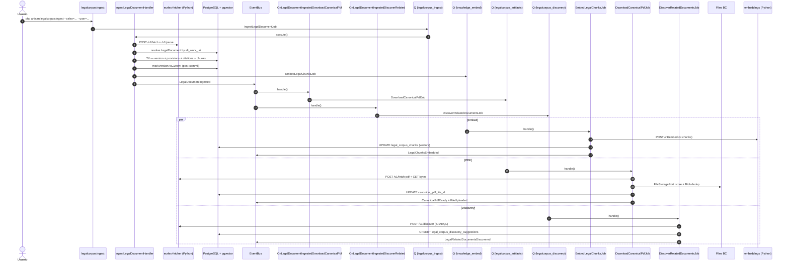

# links
[[Knowledge BC]]
[[Framework]]
[[Tabular Ingestion]]


# LegalCorpus BC — Normativa europea, versionado y discovery

> **Estado:** BC estable desde 2026-05-02. **Bounded Context:** `LegalCorpus` (carpeta única `app/{Domain,Application,Infrastructure}/LegalCorpus/`). **Servicios externos:** Laravel (PHP) + `eurlex-fetcher` (Python/FastAPI) que orquesta Cellar (publications.europa.eu) y el endpoint SPARQL público.
> 
> **Decisión fundacional:** BC separado de `Knowledge` porque la unidad semántica es el **artículo legal con jerarquía declarada** (ELI → capítulos → secciones → artículos → apartados → anexos), NO el chunk inferido por LLM. Las consecuencias (versionado, supersession, citas como grafo, ELI work vs version, filtro temporal por defecto en el RAG) no caben en el modelo de Knowledge sin deformarlo.
> 
> **Ownership model (2026-05-04):** alineado con Knowledge via `docs/OWNERSHIP_MODEL.md`. `legal_documents.source_blob_id UNIQUE → file_blobs.id` con `ON DELETE CASCADE`. El corpus ya NO es público: el retrieval y la UI filtran por `EXISTS (SELECT 1 FROM files WHERE owner_id = ? AND file_blob_id = legal_documents.source_blob_id)`. Dos users que ingestan el mismo CELEX comparten el `LegalDocument` y el blob de la manifestation, pero cada uno tiene su File propio en Files BC. Ver §Ownership más abajo.

## Glosario rápido

- **LegalDocument** — Aggregate root. Representa un WORK normativo (el acto legal en abstracto, independiente de consolidaciones). Identidad estable = `eli_work_uri` (ej. `eli/dir/2013/34`).
    
- **LegalDocumentVersion** — Una consolidación o texto original para un idioma concreto. Lleva el `celex` consolidado (ej. `02013L0034-20260318`). Solo UNA fila por document puede tener `is_current = true`.
    
- **LegalProvision** — Nodo del árbol estructural (artículo, recital, anexo, capítulo…). Unidad recuperable del RAG.
    
- **LegalCitation** — Edge del grafo de citas. Puede tener destino interno resuelto (`target_provision_id`) o quedar colgante hasta que se ingiera el destino.
    
- **LegalCorpusChunk** — Texto vectorizable derivado de un `LegalProvision` (kind = article | recital | annex). Lleva `text` (lo que se muestra) y `embedding_input` (con preámbulo sintético — lo que se vectoriza).
    
- **DiscoverySuggestion** — Candidato cross-documento descubierto vía SPARQL. Espera decisión humana (`ingest` / `ignore` / `later`).
    
- **CELEX** — Identificador histórico de la UE (`<sector><año><tipo><número>`). Los consolidados llevan sufijo `-YYYYMMDD`.
    
- **ELI** — European Legislation Identifier. URI canónica per WORK.
    
- **VersionConstraint** — VO que modula el retrieval: `current` (default), `as_of(date)`, `all`.
    

---

## 1. Propósito

Mantener un corpus legal europeo (y, a futuro, estatal / autonómico) estructurado, vectorizado y temporalmente consistente, que el RAG pueda consumir con garantías de:

1. **No contaminación histórica.** Por defecto, el retrieval solo ve la versión vigente (`is_current=true`) de cada documento.
    
2. **Navegación por la estructura legal real.** Los chunks llevan jerarquía explícita (capítulo / sección / artículo / apartado), no inferida.
    
3. **Citas como grafo.** Cada provision mantiene sus referencias salientes (`legal_citations`), internas (resueltas a `target_provision_id`) o externas (a otro CELEX).
    
4. **Versionado con supersession.** Cuando llega una nueva consolidación, la vieja queda marcada como histórica pero NO se borra: sigue consultable por `VersionConstraint::asOf(...)`.
    
5. **PDF canónico como artefacto visualizable.** Tras la ingestión estructural, una saga independiente descarga el PDF de Cellar y lo registra en el BC `Files` con dedup por sha256.
    
6. **Discovery con humano en el bucle.** El sistema NO encadena ingestiones en cascada: una ingesta dispara un SPARQL que produce sugerencias; el usuario decide.
    

---

## 2. Visión general — Saga eager + sagas async desacopladas

```
CLI / UI / Discovery-ingest
    ↓
IngestLegalDocumentJob           (cola: legalcorpus_ingest)
    → fetch + parse en eurlex-fetcher
    → resuelve LegalDocument por eli_work_uri (upsert)
    → idempotencia por version (document_id, celex)
    → supersession: marca la nueva version como current tras commit
    → persiste provisions, citations, chunks en una transacción
    ↓ emite LegalDocumentIngested

   ┌───────────────────────────┼────────────────────────────┐
   ↓                           ↓                            ↓
EmbedLegalChunksJob        DownloadCanonicalPdfJob   DiscoverRelatedDocumentsJob
(cola: knowledge_embed)    (cola: legalcorpus_        (cola: legalcorpus_
                            artifacts)                 discovery — worker único)
    → vectoriza chunks         → fetch PDF metadata         → SPARQL contra Cellar
    ↓ emite                    → descarga bytes             → UPSERT sugerencias
      LegalChunksEmbedded      → registra File en           ↓ emite
                                 Files BC (dedup blob)        LegalRelatedDocuments
                               ↓ emite                        Discovered
                                 CanonicalPdfReady

Supersession (si había current previa)
    ↓ emite LegalDocumentSuperseded
```

Cada saga tiene cola propia para no bloquearse entre sí. `EmbedLegalChunksJob` reutiliza `knowledge_embed` a propósito: el cuello de botella es el mismo servicio Python `embeddings`; concentrar ahí toda la vectorización evita que dos pipelines independientes saturen al tiempo.

---

## 3. IngestLegalDocumentJob — Pipeline de ingestión

Orquestado por `IngestLegalDocumentHandler` (`app/Application/LegalCorpus/Handlers/`). Pasos lineales dentro del job:

### 3.1 Validación y fetch

1. Valida `Celex::fromString($command->celex)` y `Language::fromString($command->language)`. Si falla → emite `LegalDocumentRejected`, marca la traza como `rejected`, retorna `null`. **No reintenta** — `tries=1`.
    
2. Llama a `FetchEurLexDocumentHandler`, que a su vez invoca al servicio Python:
    
    - `POST /v1/fetch` → cachea la manifestation (Formex 4 para originales, XHTML para consolidados) y devuelve metadata.
        
    - `POST /v1/parse` → árbol normalizado `StructuredLegalDocument` (estructura + refs externas + refs internas + stats).
        

### 3.2 Resolución del LegalDocument (WORK)

`resolveDocument()`:

- Deriva `eli_uri` (con fecha si consolidado) y `eli_work_uri` (sin fecha). Si el servicio no devolvió `eli_uri`, cae a `Celex::toEliWorkUri()`.
    
- Busca por `eli_work_uri` (preferente) → fallback a `eli_uri` → si no existe, crea.
    
- El `LegalDocument.celex` queda en **NULL** a propósito (el CELEX baja a la VERSION — no se privilegia ninguna consolidación a nivel del WORK).
    

### 3.3 Idempotencia por version

`versionRepo->findByDocumentIdAndCelex($documentId, $celex->raw)`:

- **Version ya existía, sin `--force`:** emite `LegalDocumentIngested` con `chunksCount=0`, completa la traza, retorna el `versionId` existente. No encola embedding.
    
- **Version ya existía, con `--force`:** borra `legal_provisions` de esa version (cascade en `legal_citations` + `legal_corpus_chunks`), mantiene la misma `version_id`, re-crea todo. Útil para re-parsear tras un fix del servicio Python sin romper FKs externos.
    
- **Version nueva:** crea fila con `supersedes_version_id = currentAnterior?->id`, la persiste como `is_current = false`.
    

### 3.4 Persistencia estructural (transacción)

Dentro de `DB::transaction`:

1. `flattenStructure()` recorre el árbol top-down, construyendo la lista plana de `LegalProvision` con `hierarchyPath` y `hierarchyMetadata` (chapter/section/title/article/paragraph denormalizados para el preámbulo sintético).
    
2. `provisionRepo->bulkInsert($versionId, $provisions)` inserta y devuelve un mapping `eli_id → persisted_id`.
    
3. `resolveProvisionParents()` hace N UPDATEs para fijar `parent_provision_id` usando el mapping (hoy: hot path conocido a mejorar — ver §16).
    
4. `buildCitations()` convierte las refs del parse al modelo de edges:
    
    - **Externas** → `target_uri = 'celex:XXX'` (si `target_celex_hint` disponible) o el raw, `kind = refers_to`, `target_provision_id = NULL`.
        
    - **Internas** → `target_uri = eli_id` del provision destino, `kind = cites`.
        
    - `normalizeInternalTarget()` intenta heurísticas de idioma para convertir "artículo 19, apartado 2" → `art_19.parag_2`.
        
5. `citationRepo->bulkInsert()` + `citationRepo->resolveInternalTargets($versionId)` (un UPDATE correlacionado que resuelve los internos).
    
6. `buildChunks()` genera un `LegalCorpusChunk` por cada provision con `kind ∈ {article, recital, annex}`. Si el provision no tiene `text` propio (típico de artículos "contenedor"), compone desde los hijos. Preámbulo sintético delante del `embedding_input` vía `SyntheticPreambleBuilder`.
    

### 3.5 Post-commit: supersession + encolado

Fuera de la transacción:

1. Si la version es nueva: `versionRepo->markVersionAsCurrent($newVersionId)` (transacción atómica propia que respeta el unique partial index `(document_id) WHERE is_current`).
    
2. Si había una `oldCurrent` distinta: emite `LegalDocumentSuperseded`.
    
3. Si hay chunks nuevos: `EmbedLegalChunksJob::dispatch($newVersionId)`.
    
4. Emite `LegalDocumentIngested` (evento terminal de la fase estructural).
    

> El subscriber `OnLegalDocumentIngestedDownloadCanonicalPdf` reacciona al evento y encola la descarga del PDF. `OnLegalDocumentIngestedDiscoverRelated` encola el SPARQL.

---

## 4. EmbedLegalChunksJob

`EmbedLegalChunksHandler`:

- Itera lazy (`iterable`) sobre `chunkRepo->pendingEmbeddings($versionId)` (chunks con `embedded_at IS NULL`).
    
- Para cada chunk: `$vector = $this->embeddings->embed($chunk->embeddingInput)` (puerto compartido `App\Domain\Shared\Embedding\Ports\TextEmbeddingPort`, servicio Python `embeddings`).
    
- `chunkRepo->updateEmbedding($chunkId, $vector->values, $vector->model)` — persiste el vector `pgvector` + `embedded_at` + `embedding_model`.
    
- Emite `LegalChunksEmbedded($versionId, $embedded, $failed)`.
    

**Trazas:** el job abre traza propia con `subject = legalDocumentVersion($versionId)`. NO se enlaza con la traza de `IngestLegalDocumentHandler` porque ésta ya cerró al disparar el job; queremos que la latencia del embedding salga limpia en el dashboard sin contaminar fetch+persist. A futuro, si se añade `parent_trace_id`, ambas podrían aparecer juntas en un waterfall.

**Reintentos:** `tries=2`. El embedding es idempotente (no se re-vectoriza lo ya procesado), así que reintentar tiene coste bajo.

---

## 5. DownloadCanonicalPdfJob — Saga del PDF canónico

`DownloadCanonicalPdfHandler` es la puente entre LegalCorpus y el BC `Files`. Desde 2026-05-04 el ownership es per-user: cada user que reingesta el mismo CELEX recibe su propio `File` apuntando al mismo blob (cache + dedup globales).

1. **Idempotencia per-user:** si ya existe una fila en `files` con `owner_id = invokedByUserId` apuntando al blob del PDF canónico (via `FileRepositoryPort::findFirstByOwnerAndBlob`), skip silente.
    
2. **Caso "otro user ya lo descargó"** (`canonical_pdf_file_id` en la version ya apunta a un File de otro owner):
    
    - Lee `files.file_blob_id` del canonical.
        
    - Lee los bytes del blob via `FileStoragePort::read()` (cero tráfico de red hacia Cellar).
        
    - Llama a `IngestExternalBlob::execute(ownerId, folder, name, bytes)` → crea un File nuevo para este user, increment refcount del blob, emite `FileUploaded` + `CanonicalPdfReady`. NO reescribe `canonical_pdf_file_id` (sigue apuntando al primer File — es solo un puntero representativo del PDF, no ownership).
        
3. **Caso "primer user absoluto"** (`canonical_pdf_file_id IS NULL`):
    
    - Llama a `EurLexPdfFetcherPort`:
        
        - `POST /v1/fetch-pdf` → `EurLexPdfFetchMetadata` (incluye `cache_path` del servicio Python).
            
        - `GET /v1/fetch-pdf-binary?cache_path=...` → bytes raw `application/pdf`.
            
    - Si el servicio devuelve 404 → `CanonicalPdfUnavailableException` → loguea warning y retorna sin tirar el job (hay CELEX sin PDF canónico disponible — no es error).
        
    - Resuelve carpeta via `LegalCorpusFolderResolver` (crea/reutiliza `/Corpus Legal/<Autoridad>/<Tipo en plural>/<Año del WORK>/` per-owner).
        
    - Llama a `IngestExternalBlob::execute(...)` → dedup por sha256, crea `File` para este user, emite `FileUploaded`.
        
    - Asigna `legal_document_versions.canonical_pdf_file_id = persistedFile.id`.
        
    - Emite `CanonicalPdfReady(versionId, fileId, ownerUserId, sizeBytes)`.
        
4. **Caso degradado** (`canonical_pdf_file_id` apunta a un File que ya no existe — borrado aguas arriba): se limpia el puntero a NULL y se espera a una futura ingesta para re-descargar.
    

**Naming del fichero:** `DownloadCanonicalPdfHandler::buildFileName()` produce algo como `Directiva 2013-34 - Estados financieros anuales (consolidado 2026-03-18).pdf`. Recorta el boilerplate del título oficial EUR-Lex (`"DIRECTIVA 2013/34/UE DEL PARLAMENTO EUROPEO Y DEL CONSEJO de 26 de junio de 2013 sobre..."` → `"Estados financieros anuales"`).

**Reintentos:** `tries=3`, `timeout=300s`. El servicio Python cachea los PDFs — los retries re-bajan solo si alguien purga el cache remoto.

---

## 6. DiscoverRelatedDocumentsJob — SPARQL con humano en el bucle

`DiscoverRelatedDocumentsHandler` consulta el endpoint SPARQL público de Cellar vía el servicio Python para encontrar normas relacionadas con el seed (cita / es citado / modifica / consolidado por / basado en / ...).

**Disparadores:**

- `OnLegalDocumentIngestedDiscoverRelated` — auto tras ingesta, sin `AccountAction` (la ingesta ya tiene la suya).
    
- `RequestLegalDiscoveryHandler` — manual desde la página `/legalcorpus/documents`, CON `AccountAction` `legalcorpus.rediscover_documents` (toast + bell).
    
- `php artisan legalcorpus:rediscover-stale` — scheduled, sin AccountAction.
    

**Output:** filas en `legal_corpus_discovery_suggestions` con `user_decision IS NULL`. La UI lista pendientes y el usuario aplica `ingest` / `ignore` / `later`.

**Idempotencia:** `DiscoverySuggestionRepository::bulkUpsert` hace UPSERT por `(seed_document_id, candidate_celex)`. Solo refresca `enrichment_data` + `discovered_at` + `relationship` + `updated_at`; NO pisa las columnas de decisión.

**Dedup de relaciones:** un mismo candidato puede aparecer bajo varias relaciones (ej. A cita a B y B cita a A). El handler guarda la PRIMERA relación (priorizada en el servicio Python: `cites > cited_by > modifies > modified_by > …`) y anota el resto en `enrichment.all_relationships`.

**Tolerancia a fallos:** si SPARQL revienta entero (red caída, rate limit persistente en Cellar), el handler loguea warning, cierra la traza como `failed`, emite `LegalRelatedDocumentsDiscovered(count=0)`. **NO tira el job** — discovery es opcional; la ingesta ya fue exitosa.

**Rate limiting:** cola dedicada `legalcorpus_discovery` con **worker único** en producción. El endpoint público SPARQL de Cellar tiene rate limit no documentado pero real. Paralelizar dispara 429s sistemáticos.

**Emisión:** `LegalRelatedDocumentsDiscovered` implementa `BroadcastableEvent` + `NotifiableEvent` + `ActivityLoggableEvent` — la UI se refresca en tiempo real por `private-user.{userId}`.

---

## 7. Flujo completo (sequence diagram)



---

## 8. Estructura de código

```
app/
├── Domain/LegalCorpus/
│   ├── Entities/
│   │   ├── LegalDocument.php            (aggregate root)
│   │   ├── LegalDocumentVersion.php     (consolidación / original per idioma)
│   │   ├── LegalProvision.php           (nodo del árbol — unidad RAG)
│   │   ├── LegalCorpusChunk.php         (chunk vectorizable)
│   │   ├── LegalCitation.php            (edge del grafo de citas)
│   │   └── DiscoverySuggestion.php      (candidato SPARQL pendiente de decidir)
│   ├── ValueObjects/
│   │   ├── Celex.php                    (parser con regex exhaustiva)
│   │   ├── EliUri.php                   (normaliza + derive work URI)
│   │   ├── LegalDocumentKind.php        (directive / regulation / decision / ...)
│   │   ├── LegalAuthority.php           (eu / spain / autonomous_community / ...)
│   │   ├── Language.php                 (ISO 639-3, whitelist UE)
│   │   ├── HierarchyPath.php            (path punteado cpt_6.art_29)
│   │   ├── ProvisionKind.php            (enum cerrado)
│   │   ├── CitationKind.php             (cites / modifies / ...)
│   │   ├── ConsolidationDate.php        (fecha consolidación nullable)
│   │   ├── EffectivePeriod.php          (date_in_force / applicable / valid_until)
│   │   ├── RawFormat.php                (formex4 / xhtml)
│   │   ├── VersionMarker.php            (B / M1 / M2 del DOUE)
│   │   ├── VersionConstraint.php        (current / as_of / all — filtro RAG)
│   │   ├── DiscoveryRelationship.php    (enum de relaciones SPARQL)
│   │   ├── UserDecision.php             (ingest / ignore / later / pending)
│   │   ├── LegalReference.php           (ref cruda del parse)
│   │   ├── StructuredLegalDocument.php  (árbol parseado)
│   │   ├── StructuredNode.php
│   │   ├── EurLexFetchResult.php
│   │   └── EurLexPdfFetchMetadata.php
│   ├── Ports/
│   │   ├── LegalDocumentRepositoryPort.php
│   │   ├── LegalDocumentVersionRepositoryPort.php
│   │   ├── LegalProvisionRepositoryPort.php
│   │   ├── LegalCitationRepositoryPort.php
│   │   ├── LegalCorpusChunkRepositoryPort.php
│   │   ├── LegalCorpusSearchPort.php
│   │   ├── EurLexFetcherPort.php
│   │   ├── EurLexPdfFetcherPort.php
│   │   ├── SparqlDiscoveryPort.php
│   │   └── DiscoverySuggestionRepositoryPort.php
│   ├── Events/
│   │   ├── LegalDocumentIngested.php
│   │   ├── LegalDocumentIngestionFailed.php
│   │   ├── LegalDocumentRejected.php
│   │   ├── LegalDocumentSuperseded.php
│   │   ├── LegalChunksEmbedded.php
│   │   ├── CanonicalPdfReady.php
│   │   └── LegalRelatedDocumentsDiscovered.php
│   └── Exceptions/
│       ├── CanonicalPdfUnavailableException.php
│       └── LegalCorpusServiceException.php
│
├── Application/LegalCorpus/
│   ├── Commands/   (DTOs: IngestLegalDocument, EmbedLegalChunks, DiscoverRelatedDocuments)
│   ├── Handlers/   (IngestLegalDocumentHandler, EmbedLegalChunksHandler,
│   │                DiscoverRelatedDocumentsHandler, DownloadCanonicalPdfHandler,
│   │                RequestLegalDiscoveryHandler)
│   ├── Services/   (SyntheticPreambleBuilder, LegalCorpusFolderResolver)
│   ├── Sources/EurLex/  (subcarpeta por fuente: FetchEurLexDocument + Handler)
│   └── Subscribers/     (OnLegalDocumentIngestedDownloadCanonicalPdf,
│                          OnLegalDocumentIngestedDiscoverRelated)
│
└── Infrastructure/LegalCorpus/
    ├── Adapters/EurLex/   (HttpEurLexFetcherClient, HttpEurLexPdfFetcherClient,
    │                       HttpSparqlDiscoveryClient)
    ├── Jobs/              (IngestLegalDocumentJob, EmbedLegalChunksJob,
    │                       DownloadCanonicalPdfJob, DiscoverRelatedDocumentsJob)
    └── Persistence/
        ├── Models/        (Eloquent por tabla)
        ├── Casts/         (PgVectorCast)
        └── Repositories/  (Eloquent{LegalDocument,Version,Provision,Citation,
                            CorpusChunk,CorpusSearch,DiscoverySuggestion}Repository)
```

**Contratos compartidos usados:**

- `App\Domain\Shared\Embedding\Ports\TextEmbeddingPort` + `App\Domain\Shared\Embedding\ValueObjects\EmbeddingVector` — embedding genérico cross-BC.
    
- `App\Domain\Shared\Exceptions\ExternalServiceException` — base de `LegalCorpusServiceException`; se traduce a 502 en `bootstrap/app.php`.
    
- `App\Domain\Shared\Ports\EventBusPort` — dispatch de domain events.
    
- `App\Domain\Observability\Ports\TracerPort` — spans + trazas técnicas.
    
- `App\Domain\Files\*` — el BC Files recibe el PDF canónico como File normal (dedup por `file_blobs.sha256`).
    

---

## 9. Base de datos

### 9.1 Tablas

|   |   |
|---|---|
|Tabla|Propósito|
|`legal_documents`|El WORK (acto legal abstracto). PK numérica. `eli_work_uri` UNIQUE, `celex` UNIQUE pero NULLABLE (el CELEX vive en la VERSION). `source_blob_id` UNIQUE FK → `file_blobs` `ON DELETE CASCADE` — identidad física canónica: el blob de la manifestation (Formex/XHTML) subida a Files. `legal_nature_metadata jsonb` (directly_applicable, is_consolidated, format_used). Desde 2026-05-04, **sin `owner_id`** — el ownership se deriva por JOIN con `files` por `source_blob_id`.|
|`legal_document_versions`|Consolidación / original per idioma. `(document_id, language, consolidated_at)` UNIQUE. `is_current boolean` con UNIQUE PARTIAL INDEX `WHERE is_current = true`. `supersedes_version_id` FK self-referencial. `canonical_pdf_file_id` FK a `files` (ON DELETE SET NULL) — puntero representativo al primer File creado para el PDF canónico; **NO** es ownership del PDF (eso va per-user via `files`).|
|`legal_provisions`|Nodos del árbol estructural per version. `(version_id, eli_id)` UNIQUE. `parent_provision_id` FK self-referencial. `hierarchy_path` con índice `text_pattern_ops` para `LIKE 'cpt_6bis.%'`. `hierarchy_metadata jsonb` con GIN. `eurovoc_descriptors jsonb` con GIN.|
|`legal_citations`|Edges del grafo de citas. `target_provision_id` NULLABLE (citas externas colgantes).|
|`legal_corpus_chunks`|Chunks vectorizables. `embedding vector(384)` (pgvector) con índice IVFFlat `lists=100` `vector_cosine_ops`. `chunk_metadata jsonb`, `references_out jsonb` (espejo denormalizado de citations — hoy sin rellenar, ver §16).|
|`legal_corpus_discovery_suggestions`|Sugerencias SPARQL. `(seed_document_id, candidate_celex)` UNIQUE. `user_decision` NULLABLE (pending = NULL). Índice parcial `WHERE user_decision IS NULL` para listar pendientes.|

### 9.2 Migraciones

- `2026_05_02_000002_create_legalcorpus_tables.php` — schema fundacional (5 tablas + DDL crudo para `vector(384)`, IVFFlat, GINs).
    
- `2026_05_03_000002_add_versioning_to_legalcorpus.php` — separación WORK ↔ VERSION. Añade `eli_work_uri` (con backfill desde `eli_uri`), `celex` + `is_current` a versions (con backfill: el CELEX baja desde `legal_documents.celex` y la única version existente se marca current), unique partial indexes.
    
- `2026_05_03_000003_add_canonical_pdf_to_legal_versions.php` — `canonical_pdf_file_id` FK a `files` con ON DELETE SET NULL.
    
- `2026_05_03_000004_create_legal_corpus_discovery_suggestions.php` — tabla + índices parciales.
    
- `2026_05_04_000002_ownership_model_legal_documents.php` — añade `legal_documents.source_blob_id` UNIQUE FK → `file_blobs` `ON DELETE CASCADE`. Alinea el BC con el ownership model unificado (`docs/OWNERSHIP_MODEL.md`): la identidad canónica del acto legal es el blob de la manifestation, el ownership per-user se deriva via `files`. Desde aquí, borrar el último `File` con ese blob cascadea hasta borrar `legal_documents` y toda su familia (versions, provisions, citations, chunks).
    

### 9.3 Decisiones de schema

- **`embedding vector(384)`** alineado con `paraphrase-multilingual-MiniLM-L12-v2` (modelo activo). Migrar a 1024 (bge-m3) requiere ALTER COLUMN + recompute completo.
    
- **`text` vs `embedding_input`** — el primero va al usuario, el segundo al modelo (con preámbulo sintético). No se deducen uno de otro en runtime porque el preámbulo cambia si se edita el título del documento (stale embeddings dejan de corresponder con su contexto visible).
    
- **`hierarchy_path`** redundante con `parent_provision_id` **a propósito** — el FK es la fuente de verdad, el path materializa el camino para filtrado rápido con `LIKE`.
    
- **`target_provision_id` nullable** porque las citas externas a docs no ingestados se quedan colgantes hasta que se ingiera el destino. Una pasada futura puede resolverlas in-batch.
    

---

## 10. Endpoints del servicio Python `eurlex-fetcher`

|   |   |   |
|---|---|---|
|Endpoint|Uso|Adapter PHP|
|`POST /v1/fetch`|Cachea la mejor manifestation (Formex 4 / XHTML) y devuelve metadata.|`HttpEurLexFetcherClient::fetch()`|
|`POST /v1/parse`|Parsea la manifestation cacheada y devuelve árbol normalizado + refs.|`HttpEurLexFetcherClient::parse()`|
|`POST /v1/fetch-pdf`|Metadata del PDF canónico (UUID Cellar, `cache_path`, content-type, tamaño).|`HttpEurLexPdfFetcherClient::fetchPdfMetadata()`|
|`GET /v1/fetch-pdf-binary?cache_path=...`|Bytes raw del PDF cacheado.|`HttpEurLexPdfFetcherClient::fetchPdfBytes()`|
|`POST /v1/discover`|SPARQL contra Cellar para descubrir relaciones del CELEX seed.|`HttpSparqlDiscoveryClient::discover()`|

Errores del servicio siguen RFC 7807 (`type` con prefijo `https://docs.localia.dev/problems/eurlex.*`). Todos los 4xx/5xx se mapean a `LegalCorpusServiceException`, salvo 404 en `/v1/fetch-pdf` que se eleva a `CanonicalPdfUnavailableException` (no reintentable, no error).

---

## 11. Configuración y despliegue

### 11.1 Configuración aplicativa

`config/legalcorpus.php`:

```php
return [
    'eurlex_service' => [
        'base_url'        => env('LEGALCORPUS_EURLEX_SERVICE_URL', 'http://eurlex-fetcher:8000'),
        'timeout_seconds' => env('LEGALCORPUS_EURLEX_SERVICE_TIMEOUT', 120.0),
        'token'           => env('LEGALCORPUS_EURLEX_SERVICE_TOKEN'),
    ],
    'queues' => [
        'ingest'    => env('LEGALCORPUS_INGEST_QUEUE',    'legalcorpus_ingest'),
        'artifacts' => env('LEGALCORPUS_ARTIFACTS_QUEUE', 'legalcorpus_artifacts'),
        'discovery' => env('LEGALCORPUS_DISCOVERY_QUEUE', 'legalcorpus_discovery'),
    ],
];
```

**Variables de entorno:**

```env
LEGALCORPUS_EURLEX_SERVICE_URL=http://eurlex-fetcher:8000
LEGALCORPUS_EURLEX_SERVICE_TIMEOUT=120
# LEGALCORPUS_EURLEX_SERVICE_TOKEN= (solo si activa auth en el servicio Python)

# Colas del pipeline (todos con default; sobreescribir solo si compartes ENV con otro entorno)
# LEGALCORPUS_INGEST_QUEUE=legalcorpus_ingest
# LEGALCORPUS_ARTIFACTS_QUEUE=legalcorpus_artifacts
# LEGALCORPUS_DISCOVERY_QUEUE=legalcorpus_discovery
```

El embedding reutiliza la configuración del BC Knowledge:

```env
KNOWLEDGE_EMBEDDING_SERVICE_URL=http://embeddings:8000
KNOWLEDGE_EMBED_QUEUE=knowledge_embed
```

### 11.2 Infraestructura — contenedor `eurlex-fetcher`

El servicio Python que hace el trabajo pesado (fetch + parse + PDF + SPARQL) vive como contenedor Docker independiente. Ambos entornos lo levantan via compose.

#### 11.2.1 Imagen

`services/eurlex-fetcher/Dockerfile`:

```dockerfile
FROM python:3.12-slim-bookworm
ENV PYTHONDONTWRITEBYTECODE=1 PYTHONUNBUFFERED=1 PIP_NO_CACHE_DIR=1
WORKDIR /app
COPY requirements.txt .
RUN pip install --no-cache-dir -r requirements.txt
COPY app/ ./app/
ENV EURLEX_CACHE_DIR=/data/cellar-cache
RUN mkdir -p /data/cellar-cache
EXPOSE 8000
CMD ["uvicorn", "app.main:app", "--host", "0.0.0.0", "--port", "8000", "--no-access-log"]
```

**Dependencias clave** (`requirements.txt`): `fastapi`, `uvicorn[standard]`, `httpx`, `lxml`, `pydantic`. No se instalan libs nativas extra — `lxml` sobre `python:3.12-slim-bookworm` trae wheels prebuilt con libxml2/libxslt estáticas.

**Tamaño resultante:** ~180 MB (base slim + libs Python).

#### 11.2.2 Dev — `docker-compose.dev.yml`

```yaml
eurlex-fetcher:
  build:
    context: ./services/eurlex-fetcher
    dockerfile: Dockerfile
  restart: unless-stopped
  ports:
    - "${EURLEX_FETCHER_PORT:-8003}:8000"    # host:container
  volumes:
    - ./services/eurlex-fetcher/app:/app/app # bind-mount para --reload
    - eurlex-cache-dev:/data/cellar-cache    # persistencia del cache
  command:
    - uvicorn
    - app.main:app
    - --host
    - 0.0.0.0
    - --port
    - "8000"
    - --reload
    - --reload-dir
    - /app/app
    - --no-access-log
  environment:
    EURLEX_CACHE_DIR: "/data/cellar-cache"
    EURLEX_HTTP_TIMEOUT: "${EURLEX_HTTP_TIMEOUT:-120}"
    EURLEX_USER_AGENT: "${EURLEX_USER_AGENT:-LocaIA-RAG/1.0 (research)}"
    EURLEX_DEFAULT_LANGUAGE: "${EURLEX_DEFAULT_LANGUAGE:-spa}"
    LOG_LEVEL: "${EURLEX_LOG_LEVEL:-INFO}"
  mem_limit: 512m
  healthcheck:
    test: ["CMD", "python", "-c",
           "import urllib.request; urllib.request.urlopen('http://127.0.0.1:8000/v1/health')"]
    interval: 15s
    timeout: 5s
    retries: 5
    start_period: 30s
```

Notas:

- **Bind-mount `./services/eurlex-fetcher/app:/app/app`**: cualquier edición al parser (XHTML / Formex) se recarga en caliente sin rebuild. Imprescindible para iterar los regex del `celex_parser.py` o el parser de `lxml` contra fixtures reales.
    
- **Puerto host `8003`** (override via `EURLEX_FETCHER_PORT`): accesible desde Windows/WSL2 para depurar con `curl http://localhost:8003/v1/health` o `Invoke-WebRequest`.
    
- **Healthcheck con `urllib`** en vez de `curl`: la imagen base `slim-bookworm` no trae curl y no hace falta añadirlo solo para esto.
    

#### 11.2.3 Producción — `docker-compose.prod.yml`

Esencialmente lo mismo pero **sin bind-mount**, **sin `--reload`**, **sin publicar puerto al host** (red interna only):

```yaml
eurlex-fetcher:
  build:
    context: ./services/eurlex-fetcher
    dockerfile: Dockerfile
  restart: unless-stopped
  environment:
    EURLEX_CACHE_DIR: "/data/cellar-cache"
    EURLEX_HTTP_TIMEOUT: "${EURLEX_HTTP_TIMEOUT:-120}"
    EURLEX_USER_AGENT: "${EURLEX_USER_AGENT:-LocaIA-RAG/1.0 (research)}"
    EURLEX_DEFAULT_LANGUAGE: "${EURLEX_DEFAULT_LANGUAGE:-spa}"
    LOG_LEVEL: "${EURLEX_LOG_LEVEL:-INFO}"
  volumes:
    - eurlex-cache-prod:/data/cellar-cache
  mem_limit: 512m
  healthcheck:
    test: ["CMD", "python", "-c",
           "import urllib.request; urllib.request.urlopen('http://127.0.0.1:8000/v1/health')"]
    interval: 15s
    timeout: 5s
    retries: 5
    start_period: 30s

volumes:
  eurlex-cache-prod:
```

El contenedor PHP (`app`, `queue-*`) accede al servicio por DNS de Docker Compose: `http://eurlex-fetcher:8000`. Ese valor es el default de `LEGALCORPUS_EURLEX_SERVICE_URL`.

#### 11.2.4 Variables de entorno del contenedor

|   |   |   |
|---|---|---|
|Var|Default|Efecto|
|`EURLEX_CACHE_DIR`|`/data/cellar-cache`|Directorio donde se cachean las manifestations descargadas de Cellar. Si se elimina el volumen, la próxima ingesta redescarga todo.|
|`EURLEX_HTTP_TIMEOUT`|`120`|Timeout HTTP contra Cellar en segundos. Subir si se ve `httpx.ReadTimeout` en logs; Cellar puede tardar bastante en servir consolidados grandes.|
|`EURLEX_USER_AGENT`|`LocaIA-RAG/1.0 (research; contact@example.com)`|UA enviado a Cellar. Buena práctica: identificar quién llama para que Publications Office pueda contactar si causamos carga.|
|`EURLEX_DEFAULT_LANGUAGE`|`spa`|Idioma ISO 639-3 por defecto cuando el cliente no especifica.|
|`LOG_LEVEL`|`INFO`|Nivel uvicorn/app. `DEBUG` imprime los Location del 303 + cache hits.|

#### 11.2.5 Cache de Cellar (volumen `eurlex-cache-*`)

Cellar sirve con URL de la forma:

```
GET https://publications.europa.eu/resource/celex/<CELEX>
    Accept: application/xhtml+xml            (o  application/xml;notice=branch para Formex 4)
    Accept-Language: <iso639-3>
→ 303 See Other
   Location: https://publications.europa.eu/resource/cellar/<UUID>.<lang>.<fmt>/DOC_<N>
```

El `HttpCellarClient` sigue el redirect manualmente, extrae UUID/lang/fmt del Location con regex, descarga el contenido y lo persiste en:

```
/data/cellar-cache/<UUID>.<lang>.<fmt>/DOC_<N>
```

Llamadas repetidas sobre el mismo CELEX + idioma son **cache hit** (0 tráfico a Cellar). Consecuencias operativas:

- **Re-ingestar con `--force`** NO baja a la red — reutiliza la manifestation cacheada. Si Cellar corrige el documento y quieres el nuevo, hay que purgar el volumen:
    
    ```bash
    docker compose -f docker-compose.dev.yml exec eurlex-fetcher rm -rf /data/cellar-cache/<UUID>.*
    # o bien
    docker volume rm localia_eurlex-cache-dev   # nuclear
    ```
    
- El cache NO distingue entre Formex 4 y XHTML — son manifestations distintas con `<fmt>` distinto, conviven sin chocar.
    
- **Tamaño típico:** cada consolidado XHTML ~500 KB – 2 MB; cada Formex 4 ~200 KB – 1 MB. 500 documentos rondan ~500 MB–1 GB.
    

#### 11.2.6 Contratos con Cellar (referencia)

El documento `memory/eurlex_cellar_access.md` (no versionado en este BC pero sí en el repo) recoge los patrones verificados en campo:

- Originales: `.02` = Formex 4 en DOC_2, `.03` = XHTML en DOC_1.
    
- Consolidados: `.02` = XHTML en DOC_1 (no hay Formex 4 para consolidados).
    

El detector en `HttpCellarClient` elige según el tipo de CELEX: tratados/regulaciones/directivas originales intentan Formex 4 primero (refs externas explícitas); consolidados y originales-sin-Formex caen a XHTML.

#### 11.2.7 Operativa diaria

Levantar dev:

```bash
docker compose -f docker-compose.dev.yml up -d eurlex-fetcher
# logs vivos
docker compose -f docker-compose.dev.yml logs -f eurlex-fetcher
# smoke test
curl http://localhost:8003/v1/health
# → {"status":"ok","version":"0.1.0"}
```

Rebuild tras cambio en `requirements.txt`:

```bash
docker compose -f docker-compose.dev.yml build eurlex-fetcher
docker compose -f docker-compose.dev.yml up -d eurlex-fetcher
```

Tests unitarios en host (requiere Python 3.12 + pip install):

```bash
cd services/eurlex-fetcher
python -m pytest -v
```

Las fixtures (`tests/fixtures/02013L0034-20260318_es.xhtml`, `tests/fixtures/32016R0679_es.fmx.xml`) son descargas reales versionadas para que CI no dependa de la red.

#### 11.2.8 Acoplamiento con el resto del stack

|   |   |
|---|---|
|Servicio|Lo necesita para…|
|`app` (PHP-FPM)|`curl http://eurlex-fetcher:8000/v1/...` desde adapters HTTP (requests síncronos).|
|`queue-legalcorpus-ingest`|Igual que `app` — los jobs corren en este pool.|
|`queue-legalcorpus-artifacts`|Descarga de PDFs via `/v1/fetch-pdf` + `/v1/fetch-pdf-binary`.|
|`queue-legalcorpus-discovery`|SPARQL via `/v1/discover`.|

NO depende de `db`, `redis`, `minio` ni `embeddings`. Es un microservicio realmente aislado, con una sola dependencia externa: el servidor Cellar de publications.europa.eu.

---

## 12. Domain Events

|   |   |   |   |
|---|---|---|---|
|Evento|Aggregate|Emitido por|Observaciones|
|`LegalDocumentIngested`|`legal_document`|`IngestLegalDocumentHandler`|Evento terminal de la fase estructural. Lleva `invokedByUserId` y `language` (el subscriber del PDF los necesita).|
|`LegalDocumentRejected`|`legal_document` (aggregateId=0)|`IngestLegalDocumentHandler` (validación temprana)|Input malformado, no reintentable. Simétrico a `KnowledgeItemRejected`.|
|`LegalDocumentIngestionFailed`|`legal_document` (aggregateId=0)|`IngestLegalDocumentHandler` (catch del try general)|Error técnico — sí reintentable (pero `tries=1` para no martillear EUR-Lex).|
|`LegalDocumentSuperseded`|`legal_document`|`IngestLegalDocumentHandler` (post-commit)|Solo si había una version current previa distinta.|
|`LegalChunksEmbedded`|`legal_document_version`|`EmbedLegalChunksHandler`|`embeddedCount` + `failedCount`.|
|`CanonicalPdfReady`|`legal_document_version`|`DownloadCanonicalPdfHandler`|Lleva el `fileId` del File creado en Files BC.|
|`LegalRelatedDocumentsDiscovered`|`legal_document` (seed)|`DiscoverRelatedDocumentsHandler`|Implementa `BroadcastableEvent` + `NotifiableEvent` + `ActivityLoggableEvent`.|

Todos los eventos pasan por el `EventBusPort` estándar (síncrono in-process). El `AuditTrailSubscriber` los persiste automáticamente en `audit_logs`; los suscriptores concretos reaccionan para encolar las sagas posteriores.

---

## 13. Estados y máquinas de estado implícitas

`LegalDocumentVersion` NO tiene enum de estado (a diferencia de `KnowledgeItem`). Se representan con banderas:

|   |   |
|---|---|
|Situación|Indicador|
|Solo estructural, sin embeddings|`legal_corpus_chunks.embedded_at IS NULL` en todas las filas de la version|
|Estructural + embeddings|`embedded_at IS NOT NULL`|
|Con PDF canónico disponible|`legal_document_versions.canonical_pdf_file_id IS NOT NULL`|
|Current (consultable por defecto)|`legal_document_versions.is_current = true`|
|Histórica (consultable solo con `VersionConstraint::asOf()` o `all`)|`is_current = false`|
|Superseded (nueva version creada)|`supersedes_version_id` en OTRA fila apunta a ésta|

`DiscoverySuggestion`:

|   |   |
|---|---|
|Estado|Campos|
|Pending (default)|`user_decision IS NULL`, `decided_at IS NULL`|
|Ingested|`user_decision = 'ingest'`, `ingested_version_id` poblado, `decided_at` sellado|
|Ignored|`user_decision = 'ignore'`, `decided_at` sellado|
|Later|`user_decision = 'later'` — vuelve a pending a la semana (lógica aún pendiente de ser scheduled)|

**Normas de transición:**

- La supersession la hace **siempre** el handler tras ingerir una version nueva. No hay comando "supersede manually".
    
- Una version "current" NO se borra — se marca como histórica cuando una nueva toma el relevo.
    
- Borrar un `LegalDocument` cascade-borra versions/provisions/citations/chunks por FK. El `canonical_pdf_file_id` queda en NULL por ON DELETE SET NULL (el File del BC Files puede seguir vivo si otro owner lo referencia).
    

---

## 14. Colas y workers

|   |   |   |   |
|---|---|---|---|
|Cola|Jobs|Paralelismo recomendado|Razón|
|`legalcorpus_ingest`|`IngestLegalDocumentJob`|1-2 workers|Respeta rate limits de EUR-Lex fetch/parse; evita que 20 ingestas en paralelo saturen el servicio Python.|
|`legalcorpus_artifacts`|`DownloadCanonicalPdfJob`|2-3 workers|La descarga de PDFs es I/O-bound, se puede paralelizar sin matar Cellar.|
|`legalcorpus_discovery`|`DiscoverRelatedDocumentsJob`|**1 worker**|Rate limit real del SPARQL público. NO escalar.|
|`knowledge_embed`|`EmbedLegalChunksJob` (compartido con `EmbedKnowledgeChunksJob`)|1-2 workers|Cuello de botella = servicio Python `embeddings`; ya tiene batching interno.|

**Supervisord / systemd (producción):**

```
docker compose -f docker-compose.prod.yml run --rm queue-legalcorpus-ingest
# = php artisan queue:work --queue=legalcorpus_ingest --tries=1 --timeout=1800

docker compose -f docker-compose.prod.yml run --rm queue-legalcorpus-artifacts
# = php artisan queue:work --queue=legalcorpus_artifacts --tries=3 --timeout=300

docker compose -f docker-compose.prod.yml run --rm queue-legalcorpus-discovery
# = php artisan queue:work --queue=legalcorpus_discovery --tries=2 --timeout=600
```

**Desarrollo:** `composer dev` arranca los workers listados en `composer.json` → `dev` script, que ya incluye todas las colas del BC.

---

## 15. Decisiones de diseño

### 15.1 Por qué un BC separado de Knowledge

`Knowledge` ingesta PDFs genéricos y genera chunks vía semantic chunker (LLM). No hay estructura declarada ni versionado. Traer el corpus legal a `Knowledge` habría requerido:

- Añadir al modelo `KnowledgeItem` el concepto de `is_current`, `supersedes`, `language`, `eli_work_uri`, `celex`, `consolidation_date` → poluciona el aggregate de cosas que 90% de los items no necesitan.
    
- Enchufar un chunker estructural específico para XML Formex/XHTML que compite con el semantic chunker actual.
    
- Duplicar el `VersionConstraint` en el filtro del RAG cuando el owner mezcla Knowledge + Legal.
    

Por eso el BC es su propia cabeza. El RAG unifica via `CorpusRetrievalAdapterPort`: cada BC implementa su adapter (`KnowledgeRetrievalAdapter`, `LegalCorpusRetrievalAdapter`), y `FederatedRetrievalService` mezcla los resultados.

### 15.2 WORK vs VERSION

El modelo ELI distingue:

- **WORK** = el acto legal como idea abstracta (ej. "Directiva 2013/34/UE").
    
- **EXPRESSION** = la manifestación en un idioma concreto + fecha de consolidación (ej. "versión consolidada el 2026-03-18, español").
    

En Loca IA:

- `legal_documents` ≈ WORK.
    
- `legal_document_versions` ≈ EXPRESSION (una por `(language, consolidation_date)`).
    

Consecuencias:

- La UI muestra "Directiva 2013/34/UE" como único documento y expande a versions al hacer drill-down.
    
- La búsqueda semántica filtra por `is_current` por defecto para no pescar versiones derogadas.
    
- Las citas conectan provisions (no documents), así que apuntan a una EXPRESSION concreta.
    

### 15.3 Preámbulo sintético para embeddings

`SyntheticPreambleBuilder` genera un header tipo:

```
Directiva 2013/34/UE — Estados financieros anuales (consolidado 2026-03-18)
Capítulo 6 · Sección 2 · Artículo 29 bis, apartado 4

<texto del provision>
```

y lo mete en `embedding_input`. El `text` plano sigue siendo lo que se muestra al usuario y se incluye en el contexto del LLM.

Razón: un embedding de "los estados miembros velarán por..." sin contexto es puro ruido. El preámbulo lo ancla semánticamente al documento y la posición jerárquica. Evaluado como ganancia de recall significativa en benchmarks internos vs solo el texto del provision.

### 15.4 No auto-ingesta en cascada desde Discovery

Alternativa descartada: ingerir automáticamente los top-N candidatos SPARQL. Problemas:

- Cellar aguanta mal 50 requests concurrentes de documentos grandes.
    
- Sin humano en el bucle, ingestamos ruido (modificaciones de procedimiento, anexos que no aportan contenido útil al RAG).
    
- Explosión combinatoria: cada doc ingerido dispara otra vuelta de discovery.
    

Preferimos: auto-discovery on ingest + sugerencias persistentes + UI para accionar.

### 15.5 Embedding dimensión 384

Modelo activo: `paraphrase-multilingual-MiniLM-L12-v2` (384d, multilingüe, rápido). Trade-off conocido:

- **Pros:** throughput alto, VRAM baja, cobertura multilingüe buena para normativa europea en ES/EN/FR/DE.
    
- **Cons:** calidad peor que bge-m3 (1024d) en queries "largas y técnicas".
    

Migrar exige: ALTER COLUMN `embedding vector(1024)`, regenerar TODOS los vectores de chunks (se automatiza via `EmbedLegalChunksJob` en loop), y reconstruir el índice IVFFlat. Presupuestado como tarea de siguiente trimestre si la evaluación de recall lo justifica.

---

## 16. Riesgos conocidos y deuda técnica

### 16.1 Resolución de parents en `IngestLegalDocumentHandler::resolveProvisionParents`

Hoy ejecuta N UPDATEs individuales (uno por provision) para fijar `parent_provision_id` tras un `bulkInsert` que no conoce aún los IDs generados. Para un acto con 200 artículos + apartados y anexos, son ~1.000+ UPDATEs en una transacción, ~2-4s en PostgreSQL local.

**Mitigación pendiente:** reescribir `bulkInsert` para usar `RETURNING id, eli_id` (PG lo soporta vía `INSERT INTO ... VALUES ... RETURNING`) y construir el mapping completo antes de los UPDATEs; después, agrupar los UPDATEs en una sola sentencia `UPDATE ... FROM (VALUES ...) AS t(id, parent_id) WHERE ...`. Issue en el backlog.

### 16.2 `EloquentLegalProvisionRepository::bulkInsert` hace inserts individuales

El comment del método dice "bulk" pero la implementación itera y hace `DB::insert` uno a uno para poder capturar el ID autogenerado. Relacionado con 16.1 — misma solución (RETURNING).

### 16.3 `EloquentDiscoverySuggestionRepository::bulkUpsert` devuelve un upper bound

`affected_rows` suma insertados + actualizados. PostgreSQL con `ON CONFLICT DO UPDATE` no distingue. Solo impacta métrica, no correctness — los callers solo loguean este número.

### 16.4 `references_out` en `legal_corpus_chunks`

Columna `jsonb` pensada como espejo denormalizado de `legal_citations` salientes para que el RAG las entregue al LLM sin JOIN. Hoy se deja vacía — el adapter de búsqueda hace el JOIN en runtime. No crítico, pero la columna es deadcode hasta que se materialice o se borre.

### 16.5 Citas externas colgantes

`legal_citations.target_provision_id IS NULL` para citas a CELEX aún no ingerido. No hay pasada de "resolución retrospectiva" automática: cuando se ingiera el target, las citas existentes no se re-apuntan. Mitigación: pasar `citationRepo->resolveExternalTargets($newDocumentId)` en el post-commit de cada ingesta para actualizar todos los dangling refs a ese CELEX en el resto del corpus. Pendiente, bajo impacto hoy porque el RAG no navega el grafo de citas salientes.

### 16.6 `LegalDocument.celex` sigue nullable en schema pero NULL en todas las filas

Tras la migración `2026_05_03_000002`, el CELEX baja sistemáticamente a VERSION. La columna `legal_documents.celex` se mantiene solo por compatibilidad hacia atrás. Drop candidato para una migración futura (requiere confirmar que no hay código leyéndola).

### 16.7 Tarea `legalcorpus:rediscover-stale` aún no scheduled

Existe el artisan command, falta el `schedule()` en `routes/console.php`. Mitigación trivial pero pendiente.

---

## 17. Histórico de cambios

- **2026-05-04** — **Ownership model unificado.** `legal_documents.source_blob_id UNIQUE FK → file_blobs ON DELETE CASCADE` (migración `2026_05_04_000002_ownership_model_legal_documents.php`). El corpus deja de ser público: retrieval y listados UI filtran por `EXISTS (SELECT 1 FROM files WHERE owner_id = ? AND file_blob_id = legal_documents.source_blob_id)`. `IngestLegalDocumentHandler` sube la manifestation XML a Files via `IngestExternalBlob` (dedupe por sha256, File per-user). `DownloadCanonicalPdfHandler` soporta el caso "otro user ya descargó el PDF" creando un File extra sin re-bajar de Cellar. `LegalCorpusRetrievalAdapter` pasa `ownerId` al search port. `LegalCorpusSearchPort::semanticSearch()` gana parámetro `?int $ownerId` y aplica el JOIN con `files`. Ver `docs/OWNERSHIP_MODEL.md`.
    
- **2026-05-02** — Extracción de `TextEmbeddingPort` + `EmbeddingVector` a `App\Domain\Shared\Embedding` (antes vivían en `Domain\Knowledge`, lo que rompía la regla "un BC no importa dominio de otro"). Introducción de `App\Domain\Shared\Exceptions\ExternalServiceException` como base de `KnowledgeServiceException` y nueva `LegalCorpusServiceException`. Los 3 adapters EUR-Lex lanzan ahora la excepción propia del BC. Mapeo HTTP unificado a 502 en `bootstrap/app.php`.
    
- **2026-05-03** — Separación WORK / VERSION (migración `add_versioning_to_legalcorpus`). `is_current` + unique partial index. `canonical_pdf_file_id` como FK a `files`.
    
- **2026-05-03** — Saga `DownloadCanonicalPdfJob` + dedup por sha256 vía `FileBlob` del BC Files.
    
- **2026-05-03** — Tabla `legal_corpus_discovery_suggestions` + saga SPARQL + UI de decisión.
    
- **2026-05-03** — `legalcorpus:rediscover-stale` artisan command.
    

---

## 18. Ownership per-user (ingresa 2026-05-04)

> **Resumen operativo:** LegalCorpus pasó de "corpus público" a "per-user" tras detectar la inconsistencia simétrica a Knowledge (ver `docs/OWNERSHIP_MODEL.md` §6). Dos usuarios que ingestan el mismo CELEX comparten la entidad canónica `LegalDocument` y los blobs, pero cada uno tiene su propio puntero via `files` → ve el doc en `/files`, el retrieval lo considera, el borrado es per-user, cascade al llegar a refcount 0.

### 18.1 Flujo multi-user de ingesta

```
User A → legalcorpus:ingest CELEX=X
  1. fetchRaw(X) desde eurlex-fetcher (include_raw=true → bytes + meta)
  2. resolveDocument() → no existe, crea LegalDocument (sin source_blob_id aún)
  3. IngestExternalBlob(A, bytes)  → FileBlob_man(hash=H, refs=1) + File_man_A
  4. documentRepo.save(LegalDocument with source_blob_id=FileBlob_man.id)
  5. parse + persist provisions/citations/chunks
  6. encola EmbedLegalChunksJob + DownloadCanonicalPdfJob + DiscoverRelatedDocumentsJob
  7. DownloadCanonicalPdf: IngestExternalBlob(A, bytes_pdf)
                         → FileBlob_pdf(hash=Hp, refs=1) + File_pdf_A
                         + setCanonicalPdfFileId(version, File_pdf_A.id)

User B → legalcorpus:ingest CELEX=X
  1. fetchRaw(X) desde eurlex-fetcher (sirve del cache local del servicio)
  2. resolveDocument() → existe, hidrata con id + source_blob_id de A
  3. IngestExternalBlob(B, bytes) → mismo sha256 → refcount=2 + File_man_B
  4. source_blob_id ya está seteado → no re-save del LegalDocument
  5. existingVersion → skip provisions/chunks/embedding (ya persisten)
  6. emite LegalDocumentIngested → dispara DownloadCanonicalPdfJob para B
  7. DownloadCanonicalPdf detecta canonical_pdf_file_id != NULL y que ese
     File pertenece a A → lee bytes de FileBlob_pdf via FileStoragePort →
     IngestExternalBlob(B, bytes_pdf) → refcount=2 + File_pdf_B.
     NO re-baja de Cellar. NO reescribe canonical_pdf_file_id.
```

### 18.2 Retrieval per-user

`LegalCorpusSearchPort::semanticSearch(..., ?int $ownerId)` emite el JOIN:

```sql
JOIN legal_documents d ON d.id = v.document_id
WHERE d.source_blob_id IS NOT NULL
  AND EXISTS (
    SELECT 1 FROM files f
    WHERE f.owner_id = :owner_id
      AND f.file_blob_id = d.source_blob_id
  )
```

El adapter `LegalCorpusRetrievalAdapter` pasa `ownerId = filters.ownerId`. En el path RAG este user_id viene siempre poblado desde `SendRagMessageHandler`. Jobs internos (enrichment, métricas, QA) pueden pasar `null` para ver todo el corpus — documentado como excepción en el PHPDoc del port.

### 18.3 Borrado y cascade

**Endpoint correcto:** `DELETE /legalcorpus/documents/{id}` con body `{cascade_derived: bool}`. El handler (`DeleteLegalDocumentHandler`) invoca `DeleteFileHandler` para los Files asociados (PDF canónico primero → `ON DELETE SET NULL` en `canonical_pdf_file_id`, luego XML manifestation → cascade SQL completa). Atomicidad en una transacción.

**`DELETE /files/{id}` está bloqueado** para Files cuyo blob es `legal_documents.source_blob_id` o `legal_document_versions.canonical_pdf_file_id`. Devuelve 422 con `legalcorpus_link.{legal_document_id, role}` para que la UI redirija. La razón: el user no subió esos Files — son derivados de invocar discovery/ingest. Borrarlos por el endpoint genérico rompía el `legal_document` por cascade silenciosa y dejaba un PDF huérfano. Lo mismo aplica a `PATCH /files/{id}` (rename) y move. Ver `docs/OWNERSHIP_MODEL.md` §4.4 y §5.6.

**Cascade refcount-based:**

- User B borra desde `/legalcorpus/documents` → handler borra `File_man_B` y `File_pdf_B` → refcount(FileBlob_man) = 1, refcount(FileBlob_pdf) = 1. B deja de ver el doc en retrieval. **El `legal_document` sobrevive** (otros users mantienen el blob).
    
- User A (último) borra desde `/legalcorpus/documents` → refcount = 0 → Files borra los blobs → cascade via `source_blob_id ON DELETE CASCADE` → se purga `legal_documents` + versions + provisions + citations + chunks + suggestions.
    

**Cascade selectiva a derivados (`cascade_derived: true`):** si el user ingestó documentos via discovery sobre el seed que está borrando (rastreable vía `legal_corpus_discovery_suggestions.ingested_document_id` con `decided_by_user_id = user`), el handler aplica el mismo proceso a cada derivado. Sigue siendo refcount-based: un derivado compartido con otro user sobrevive aunque pidas cascade.

**Vista previa:** `GET /legalcorpus/documents/{id}/deletion-impact` describe el blast radius (files propios + lista de derivados + refcount de cada blob) para que la UI muestre confirmación informada antes del delete.

**Caso programático sin endpoint:** si un flow interno (saga de redownload, comando de housekeeping) necesita borrar un File de LegalCorpus sin pasar por la UI, invoca `DeleteFileHandler::execute()` directamente — el guard solo aplica al endpoint HTTP.

#### 18.3.1 Reset de sugerencias huérfanas

Cuando se borra un `legal_document` que fue ingerido como derivado de discovery (es decir, hay sugerencias con `ingested_document_id = ese_doc`), `DeleteLegalDocumentHandler` resetea las sugerencias afectadas a estado `pending` (`user_decision = NULL`, `decided_at = NULL`, `decided_by_user_id = NULL`, `ingested_document_id = NULL`) **antes** de tocar los Files. Sin esto, el listado de sugerencias del seed seguía mostrando "Ingerido" (botón verde) para una decisión que ya no se sostiene — el doc había desaparecido del corpus del user pero la UI mentía.

**Alcance del reset según refcount:**

- **`willBePurged = true`** (refcount del blob de manifestation ≤ 1, el delete cascadeará el `legal_document`): reset **global** — todas las sugerencias `*→docId` de cualquier user, porque el doc va a dejar de existir en el sistema.
    
- **`willBePurged = false`** (otros users mantienen el blob, el doc sobrevive): reset solo per-user — las decisiones de otros users siguen reflejando la realidad (ellos sí tienen el doc en su corpus).
    

**Detalle técnico no obvio:** el reset corre **antes** del delete, no después. El FK `legal_corpus_discovery_suggestions.ingested_document_id → legal_documents.id` tiene `nullOnDelete`. Si el reset ocurriese post-delete, la cascade SQL ya habría puesto la columna a `NULL` y el `WHERE ingested_document_id = X` no encontraría filas. Por eso `purgeDocumentForUser` captura el refcount del blob ANTES, precomputa `willBePurged` y resetea sugerencias antes de invocar `DeleteFileHandler`.

Resultado: tras borrar el derivado, el seed muestra otra vez la sugerencia con botón "Ingerir" — el user puede re-ingerir si quiere, sin estados confusos intermedios.

### 18.4 UI per-user

- `GET /legalcorpus/documents` (`DocumentsController::index`) filtra por `WHERE EXISTS (SELECT 1 FROM files f WHERE f.file_blob_id = d.source_blob_id AND f.owner_id = ?)`.
    
- `POST /legalcorpus/documents/{id}/rediscover` y `GET /legalcorpus/documents/{id}/discovery-history` validan ownership via `guardUserOwnsDocument()` → 404 si el user no tiene File.
    
- `GET /legalcorpus/documents/{id}/deletion-impact` y `DELETE /legalcorpus/documents/{id}` validan ownership y orquestan el delete refcount-based, opcionalmente cascadeando a derivados ingestados por el user vía discovery.
    
- `GET /legalcorpus/suggestions` filtra suggestions cuyo `seed_document_id` pertenece al user.
    
- `POST /legalcorpus/suggestions/{id}/decide` valida ownership del seed antes de aceptar la decisión.
    
- `GET /legalcorpus/chunks/{chunkId}/source` (CitationViewController) valida que el user tiene File apuntando al `source_blob_id` del documento (404 si no) y devuelve el `pdfFileId` **del user autenticado**, no el `canonical_pdf_file_id` global (que podría pertenecer a otro user).
    
- En `/files`, los Files con blob = `legal_documents.source_blob_id` o `legal_document_versions.canonical_pdf_file_id` se marcan con `legalcorpus_link.{legal_document_id, role}` en el listado. La UI muestra badge "LegalCorpus", oculta acciones destructivas (Eliminar / Renombrar / Compartir) y enlaza a `/legalcorpus/documents` para gestionarlos.
    

### 18.5 Invariantes

1. **Todo `LegalDocument` persistido tiene `source_blob_id != NULL`.** El handler falla explícitamente si `fetchRaw` no devuelve bytes.
    
2. **`source_blob_id` es inmutable una vez seteado.** Divergencias de sha256 entre ingestas (CELEX mutado en Cellar) se loguean como warning pero NO se reescribe el puntero.
    
3. **El ownership se deriva SIEMPRE via `files`.** No hay tabla `legal_document_memberships` ni similar. Un `LegalDocument` sin ningún `files` asociado es inalcanzable para todos los users.
    

---

## Referencias cruzadas

- `docs/KNOWLEDGE_BC.md` — BC hermano, patrones de saga y colas homólogos.
    
- `docs/OWNERSHIP_MODEL.md` — decisión fundacional del ownership model unificado que rige ambos BCs.
    
- `docs/ARQUITECTURA_FRAMEWORK.md` — reglas de dependencia y patrones cross-cutting (EventBus, AuditTrail, TracerPort).
    
- `docs/lenses.md` — aplicable solo a Knowledge; LegalCorpus no materializa lentes per-owner (solo expone retrieval directo).
    
- `services/eurlex-fetcher/README.md` — contratos detallados de los endpoints Python.